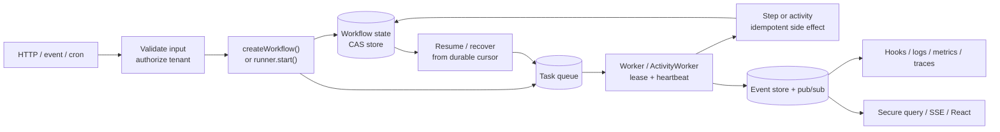
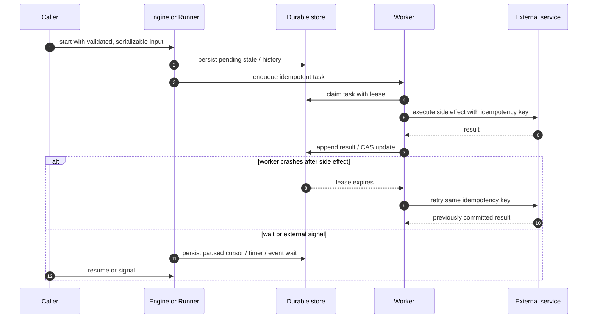
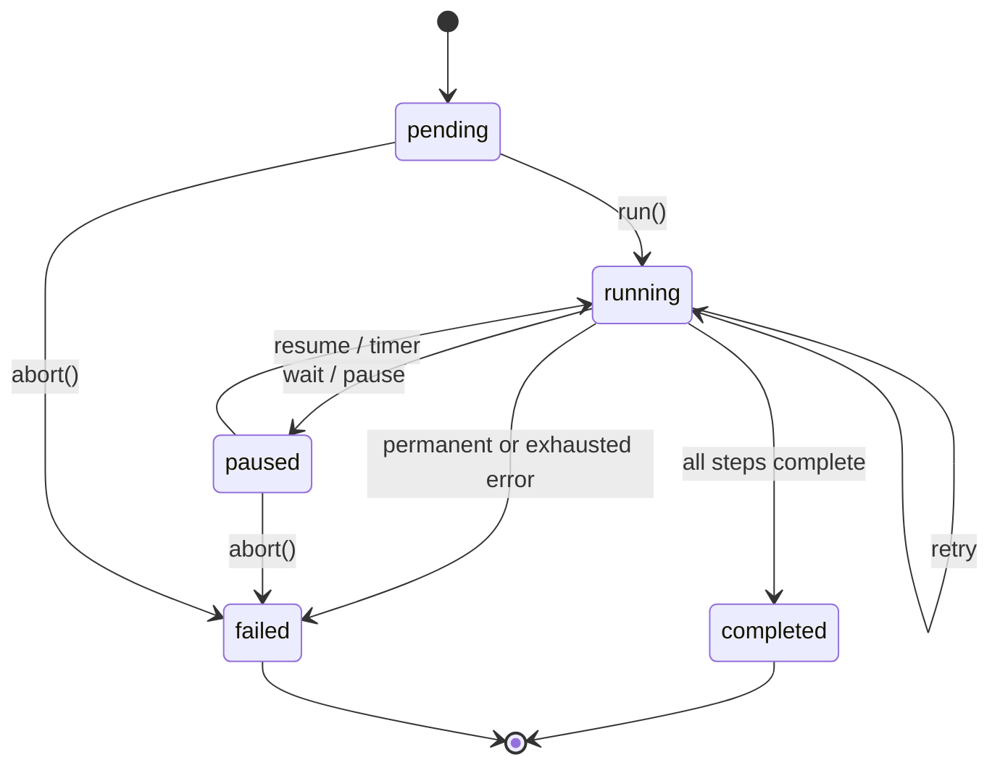
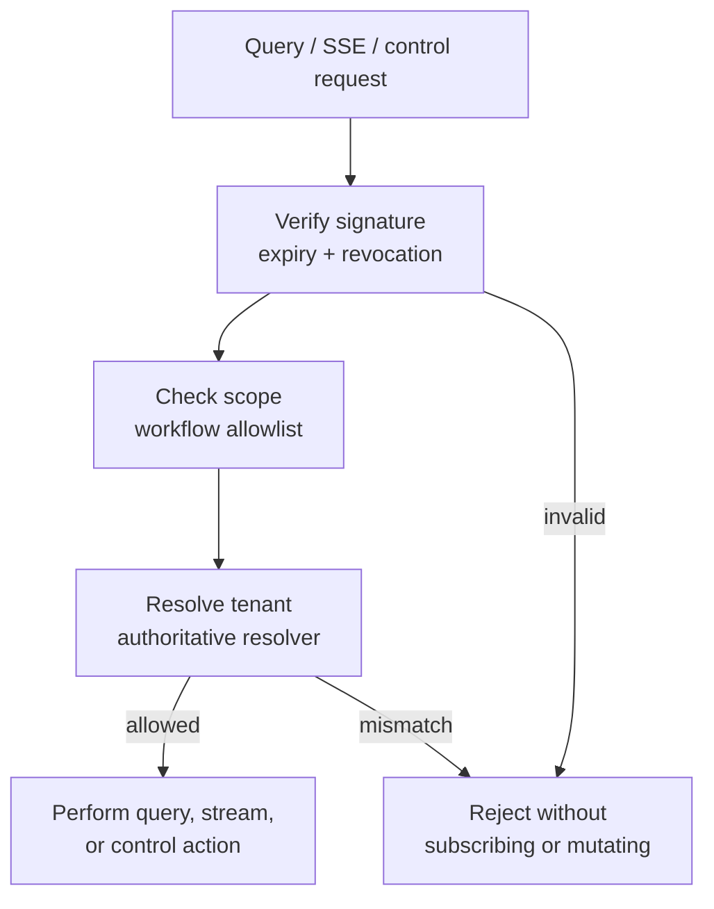

# @circulo-ai/wf

`@circulo-ai/wf` is a durable, framework-agnostic TypeScript workflow runtime
for backend jobs, agent orchestration, long-running business processes, data
pipelines, and React workflow experiences.

It includes a typed DSL, durable state transitions, retries, timeouts,
cancellation, pause/resume, scheduled waits, streaming progress, optimistic
concurrency, event persistence, pub/sub, metrics, logging, and lifecycle hooks.
It runs in Node.js, Bun, Deno, serverless handlers, queues, and TypeScript web
backends. React support is available through the optional
`@circulo-ai/wf/react` entry point.

The v3 durable runtime adds a replay-safe execution model for activities and
long-running workflows, leased workers with recovery, parallel/fan-out/fan-in
execution, external events, signed webhooks, queries, cron scheduling, Saga
compensation, duplicate-run coalescing, rate limits, tenant admission, secure
stream access, and OpenTelemetry-compatible adapters.

## Runnable examples

The package includes progressive, executable examples in
[`examples/`](./examples/README.md), from a typed durable activity through
signals, durable sleeps, fan-out, batches, compensation, deadlines, and cron
scheduling. Run them with `bun run --cwd packages/wf examples:check` and
`bun examples/01-basic-durable-activity.ts` from the package directory.

## Contents

- [Install](#install)
- [Runnable examples](#runnable-examples)
- [Mental model](#mental-model)
- [Shared application and CLI configuration](#shared-application-and-cli-configuration)
- [Production reference architecture](#production-reference-architecture)
- [Runtime states and terminal behavior](#runtime-states-and-terminal-behavior)
- [First workflow](#first-workflow)
- [Workflow definitions](#workflow-definitions)
- [Step results](#step-results)
- [Context and cancellation](#context-and-cancellation)
- [Retries and timeouts](#retries-and-timeouts)
- [Waiting and polling](#waiting-and-polling)
- [Durable replay workflows](#durable-replay-workflows)
- [Durable sleep](#durable-sleep)
- [Platform comparison](#platform-comparison)
- [Workers and recovery](#workers-and-recovery)
- [Triggers, webhooks, queries, and scheduling](#triggers-webhooks-queries-and-scheduling)
- [Limits, tenancy, and observability](#limits-tenancy-and-observability)
- [Streaming](#streaming)
- [Security model and secure defaults](#security-model-and-secure-defaults)
- [Dynamic plans and compensation](#dynamic-plans-and-compensation)
- [Validation and idempotency](#validation-and-idempotency)
- [Events](#events)
- [Lifecycle hooks](#lifecycle-hooks)
- [React](#react)
- [Durable adapters](#durable-adapters)
- [Production operations](#production-operations)
- [Testing with TDD](#testing-with-tdd)
- [API reference](#api-reference)

## Install

Node.js 18 or newer is required.

```bash
npm install @circulo-ai/wf
# or
bun add @circulo-ai/wf
# or
deno add npm:@circulo-ai/wf
```

React is optional and only needed for the React entry point:

```bash
npm install @circulo-ai/wf react
```

```typescript
// Framework-free core: Node, Bun, Deno, queues, serverless, or any TS backend.
import { WorkflowEngine, defineWorkflow, complete } from "@circulo-ai/wf";

// Optional React integration.
import { useWorkflow } from "@circulo-ai/wf/react";
```

## Shared application and CLI configuration

Use `defineWfConfig()` as the composition root when the application and a
future `wf` CLI need to use the same workflow definitions, registry, and
infrastructure choices. It is available from the core entry point and the
dedicated `@circulo-ai/wf/config` entry point:

```typescript
import { defineWfConfig } from "@circulo-ai/wf/config";
```

The configuration layer is deliberately framework- and connector-agnostic. It
does not open a Redis connection, read `process.env`, or create a global
singleton while the module is imported. A profile factory creates one runtime
when the application or tool starts, and an explicit disposer closes resources
when that process stops.

The same object can expose a workflow catalog and the allowlisted step registry
to application code and tooling. These values are references only; they are not
compiled or instantiated by `defineWfConfig()`:

```typescript
import { defineWfConfig, InMemoryWorkflowStepRegistry } from "@circulo-ai/wf";

const registry = new InMemoryWorkflowStepRegistry();
// Register application-owned step factories here.
const workflows = {
  orders: () => import("./src/workflows/orders.js"),
};

declare function createApplicationRuntime(): unknown;

export const wf = defineWfConfig({
  registry,
  workflows,
  createRuntime: () => createApplicationRuntime(),
});
```

An application can use `wf.workflows` and `wf.registry` to compile or select a
workflow, while a CLI can use them for validation and graph generation. The
runtime factory remains responsible for infrastructure and lifecycle.

### One runtime without profiles

For a small application, define one lazy runtime factory:

```typescript
import {
  defineWfConfig,
  InMemoryEventBus,
  InMemoryEventStore,
  InMemoryWorkflowStore,
  WorkflowEngine,
} from "@circulo-ai/wf";

type AppRuntime = {
  engine: WorkflowEngine<Record<string, never>, unknown, unknown>;
};

declare const workflowDefinition: import("@circulo-ai/wf").WorkflowDefinition<
  Record<string, never>,
  unknown,
  unknown
>;
declare const input: unknown;

export const wf = defineWfConfig<
  Readonly<Record<string, string | undefined>>,
  AppRuntime
>({
  createRuntime: () => {
    const engine = new WorkflowEngine({
      workflowStore: new InMemoryWorkflowStore(),
      eventStore: new InMemoryEventStore(),
      eventBus: new InMemoryEventBus(),
      enableAutoResume: false,
    });

    return { engine };
  },
});

const handle = await wf.createRuntime();
await handle.runtime.engine.createWorkflow(workflowDefinition, input);
await handle.close();
```

`createRuntime()` is lazy, so importing `wf.config.ts` does not create a
connection or start a worker. `handle.close()` is safe to call more than once;
the configured disposer runs at most once.

### Development, test, staging, and production profiles

Named profiles allow the same configuration module to be used by the server,
workers, tests, and development tooling:

```typescript
import {
  defineWfConfig,
  InMemoryEventBus,
  InMemoryEventStore,
  InMemoryWorkflowStore,
  WorkflowEngine,
} from "@circulo-ai/wf";

interface Environment {
  DATABASE_URL?: string;
  REDIS_URL?: string;
}

interface ApplicationRuntime {
  engine: WorkflowEngine<Record<string, never>, unknown, unknown>;
  closeConnections?: () => Promise<void>;
}

declare function createProductionAdapters(env: Environment): Promise<{
  workflowStore: import("@circulo-ai/wf").WorkflowStore<
    Record<string, never>,
    unknown,
    unknown
  >;
  eventStore: import("@circulo-ai/wf").EventStore<unknown>;
  eventBus: import("@circulo-ai/wf").EventBus<unknown>;
  close: () => Promise<void>;
}>;

export const wf = defineWfConfig<Environment, ApplicationRuntime>({
  defaultProfile: "development",
  profiles: {
    development: {
      create: () => ({
        engine: new WorkflowEngine({
          workflowStore: new InMemoryWorkflowStore(),
          eventStore: new InMemoryEventStore(),
          eventBus: new InMemoryEventBus(),
          enableAutoResume: false,
        }),
      }),
      dispose: ({ engine }) => engine.shutdown(),
    },

    production: {
      create: async ({ env }) => {
        if (!env.DATABASE_URL || !env.REDIS_URL) {
          throw new Error("DATABASE_URL and REDIS_URL are required");
        }

        // These factories belong to the application or connector package.
        // @circulo-ai/wf supplies the contracts; it does not assume a vendor.
        const adapters = await createProductionAdapters(env);
        return {
          engine: new WorkflowEngine({
            workflowStore: adapters.workflowStore,
            eventStore: adapters.eventStore,
            eventBus: adapters.eventBus,
            enableAutoResume: false,
          }),
          closeConnections: adapters.close,
        };
      },
      dispose: async ({ engine, closeConnections }) => {
        await engine.shutdown();
        await closeConnections?.();
      },
    },
  },
});
```

The production adapter factory is application-owned. It can compose different
ports independently, for example PostgreSQL for workflow state and events,
Redis for pub/sub and task queues, and a separate lock or idempotency store:

```text
WorkflowStore       PostgreSQL
EventStore          PostgreSQL
EventBus            Redis
WorkflowHistory     PostgreSQL
TaskQueue           Redis
Locks               Redis or PostgreSQL
Idempotency         Redis or PostgreSQL
```

The runtime constructor receives these dependencies once. Individual workflow
definitions and request handlers do not need to receive connector instances.
The current engine contracts are described in `WorkflowEngineConfig`; the
configuration API only coordinates their construction and lifecycle.

### Application usage

Create one runtime during application startup and keep its handle until
shutdown:

```typescript
import { wf } from "./wf.config.js";

const handle = await wf.createRuntime({
  profile: process.env.WF_PROFILE ?? "production",
  env: process.env,
});

const { engine } = handle.runtime;
const workflowId = await engine.createWorkflow(workflowDefinition, input);
console.log({ workflowId });

process.once("SIGTERM", () => {
  void handle.close();
});
```

Expected behavior:

```text
module import       no connections opened
createRuntime()     adapter factories run once for this runtime
worker.start()      workers begin, when the runtime includes workers
handle.close()      engine and external clients shut down
```

Do not call `createRuntime()` for every HTTP request. That would create a new
pool or client set for every request and can exhaust database or Redis
connections. Create it once at the process composition boundary and inject the
resulting runtime into request handlers.

### Reusing the configuration from the CLI

The `wf` CLI can load the same `wf.config.ts` and select a profile for
side-effect-free authoring and CI checks:

```bash
wf doctor --profile development
wf validate workflows/orders.json --profile development --json
wf graph workflows/orders.json --format mermaid
```

The CLI reads workflow metadata and the allowlisted registry, but never calls
`createRuntime()` for these commands. It does not run workflows or open Redis,
PostgreSQL, queues, or network connections. Runtime operations belong in the
application or in an explicitly authenticated operational tool.

### Memory and file adapter boundaries

An in-memory adapter belongs to one JavaScript process. A server and a separate
CLI process cannot share the same `InMemoryWorkflowStore`, event bus, or queue;
each process would create a different instance. Memory profiles are therefore
appropriate for local development, unit tests, and same-process tools.

File adapters can be shared only when their implementation provides atomic
writes, process-safe locks, recovery, and corruption handling. PostgreSQL and
Redis are appropriate cross-process boundaries when the application-owned
adapters satisfy the atomic compare-and-set, lease, enqueue, and idempotency
contracts documented by this package.

### Configuration errors and cancellation

Configuration errors are raised before a runtime is returned:

```typescript
import { WfConfigError } from "@circulo-ai/wf";

try {
  const handle = await wf.createRuntime({ profile: "missing" });
  // The application owns this handle until shutdown.
  await handle.close();
} catch (error) {
  if (error instanceof WfConfigError) {
    console.error(error.code, error.message);
  }
}
```

Available error codes are:

| Code                   | Meaning                                                   |
| ---------------------- | --------------------------------------------------------- |
| `WF_CONFIG_INVALID`    | The configuration has no valid factory or profile setup.  |
| `WF_PROFILE_NOT_FOUND` | The requested profile is not defined.                     |
| `WF_RUNTIME_ABORTED`   | Creation was cancelled before a usable runtime was ready. |

Pass an `AbortSignal` when startup has a deadline or can be cancelled:

```typescript
const controller = new AbortController();
const handle = await wf.createRuntime({ signal: controller.signal });
```

If cancellation arrives after a factory has created resources but before the
runtime is returned, the configured disposer is called before the cancellation
error is reported. If cleanup also fails, an `AggregateError` preserves both
the creation/cancellation error and the cleanup error.

`defineWfConfig()` does not create a hidden global singleton. This is
intentional: tests can create isolated runtimes, workers can own separate
profiles, and applications can control startup and shutdown explicitly.

## Mental model

A workflow has four layers:

1. A **definition** describes initial context and ordered steps.
2. The **engine** creates, runs, resumes, and controls workflows.
3. A **store** persists state and coordinates worker locks.
4. Events, hooks, logging, and metrics expose execution to integrations.

### System flow

The runtime is intentionally split into ports. Definitions describe work;
stores and queues own durability; workers own execution. This keeps the core
portable and makes each infrastructure boundary replaceable.



The classic engine persists a mutable workflow snapshot after each step. The
replay runner persists an append-only history and derives the next work item by
replaying deterministic workflow code. Do not mix the two persistence models
for one run.



The runtime persists state between steps. A worker can stop after a step,
release its lock, and resume later from durable `currentStep` and `resumeAt`
values.

```text
definition -> create -> pending -> running -> step transitions
                                      |              |
                                      v              v
                                  paused/waiting   events/hooks/metrics
                                      |
                                      v
                                  resumed -> completed or failed
```

Use in-memory implementations for local development and tests. Use a durable
store, event store, and pub/sub adapter for production workers.

## Production reference architecture

Keep workflow definitions in a shared module, but give each process one clear
responsibility:

```text
HTTP/API process
  └─ validate input -> createWorkflow() -> enqueue/run workflow

Workflow workers
  └─ claim workflow tasks -> execute steps -> persist CAS update -> ack

Activity workers                 Timer/recovery workers
  └─ execute side effects          └─ fire timers and reclaim expired leases

Durable stores                    Observability
  └─ workflow state, history,      └─ events, hooks, metrics, logs, traces
      locks, queue, idempotency
```

The smallest local setup can use the in-memory engine. A production setup
replaces every in-memory boundary that must survive a process restart:

```typescript
const engine = new WorkflowEngine({
  workflowStore: durableWorkflowStore,
  eventStore: durableEventStore,
  eventBus: durableEventBus,
  enableAutoResume: false, // a queue or scheduler owns resumption
  lockTTL: 30_000,
  lockRenewInterval: 10_000,
});

// The request returns a durable identifier. The process may exit immediately.
const workflowId = await engine.createWorkflow(orderWorkflow, input);
await workflowQueue.enqueue({ workflowId });
console.log({ workflowId });
// { workflowId: "wf_1710000000000_1_abc123" }
```

Behavior: `createWorkflow()` persists `pending` state before returning;
`run()` is the execution request, not the persistence operation. Optimistic
compare-and-set updates and expiring locks prevent two workers from committing
the same step. A worker crash can therefore leave work available for recovery,
but external side effects still need idempotency keys because delivery is
at-least-once.

### Runtime states and terminal behavior

| State       | Meaning                                      | Can resume? | Terminal? |
| ----------- | -------------------------------------------- | ----------- | --------- |
| `pending`   | Persisted, not currently executing           | Yes         | No        |
| `running`   | A worker owns the execution lease            | Yes         | No        |
| `paused`    | Waiting for a timer or explicit pause        | Yes         | No        |
| `completed` | All steps finished and output was persisted  | No          | Yes       |
| `failed`    | A non-retryable or exhausted error persisted | No          | Yes       |

`pause()` and `abort()` are durable control operations. Calling a control
operation on an already-terminal workflow is a no-op. A thrown step error is
classified as `unknown` unless the step classifier or an explicit `error()`
result supplies a type.



## Platform comparison

The table below compares the v3 durable runtime with the four products most
often evaluated alongside it. “Native” means the capability is part of the
product's primary execution model. “Adapter” means wf defines the production
contract and ships a reference implementation, while the application supplies
the durable Redis, SQL, broker, or service adapter. “Partial” means the
product can model the behavior, but it is not a first-class primitive with the
same guarantees.

| Capability                     | wf v3                                                                                                  | BullMQ                                                           | Inngest                                                                              | Trigger.dev                                                           | Temporal                                                                             |
| ------------------------------ | ------------------------------------------------------------------------------------------------------ | ---------------------------------------------------------------- | ------------------------------------------------------------------------------------ | --------------------------------------------------------------------- | ------------------------------------------------------------------------------------ |
| Primary abstraction            | Replay-safe workflows plus leased tasks                                                                | Redis-backed jobs and queues                                     | Event-triggered durable functions and steps                                          | Long-running tasks and runs                                           | Durable workflow executions and activities                                           |
| Runtime/deployment             | Framework-agnostic TypeScript library; self-hosted                                                     | Node.js library; Redis required                                  | Managed/self-hosted execution service with app compute                               | Cloud or self-hosted task platform                                    | Temporal Service/Cloud plus application workers                                      |
| Workflow replay                | **Native** ordered history and replay cursor                                                           | No workflow replay engine                                        | Durable checkpoint/memoization; not a general event-history replay API               | Durable run checkpoints; not Temporal-style deterministic replay      | **Native** event-history replay and deterministic workflow runtime                   |
| Activity/step execution        | **Native** activities, at-least-once task delivery, retry policy                                       | Jobs are at-least-once in failure cases; no activity abstraction | Retriable durable steps                                                              | Retriable task runs/steps                                             | **Native** activities with retry policies and recorded results                       |
| Determinism/versioning         | Definition name/version validation; deterministic IDs                                                  | Application responsibility                                       | SDK/platform manages step state; application code must remain compatible             | Task versioning/deploy model                                          | Strong deterministic constraints plus worker versioning/patching                     |
| Workers                        | **Native** pull workers, heartbeats, leases, graceful stop                                             | **Native** workers and concurrency                               | Platform manages execution; no user worker fleet required                            | Platform-managed queues/workers                                       | **Native** workflow/activity workers and task queues                                 |
| Multi-worker recovery          | **Native** expired-lease reclamation and recovery worker                                               | Redis lock/stall recovery                                        | Platform-managed                                                                     | Platform-managed                                                      | Service redispatches tasks; workers are stateless                                    |
| Parallel steps                 | **Native** `parallel()`                                                                                | Application orchestration / flows                                | Native parallel step patterns                                                        | Native batch/child-task fan-out                                       | Native promises/child workflows/activities                                           |
| Fan-out/fan-in                 | **Native** `fanOut()` and `batch()` join                                                               | Flows/parent-child dependencies; application join logic          | Batching and parallel steps                                                          | `batchTriggerAndWait()`                                               | Child workflows/activities and application join logic                                |
| External event / approval wait | **Native** `waitForEvent()` plus durable signal                                                        | Application state and queue coordination                         | Events, sleeps, and waits                                                            | Waits, tokens, and HTTP callbacks                                     | Signals, updates, and durable timers                                                 |
| Query current state            | **Native** history projection service                                                                  | Queue/job inspection; workflow projection is application code    | Platform run/event observability APIs                                                | Runs and Realtime APIs                                                | Native workflow queries and visibility APIs                                          |
| Event-triggered execution      | **Native** typed trigger gateway                                                                       | Queue/job enqueue; event mapping is application code             | **Native** event triggers                                                            | **Native** task triggering                                            | Signals/start APIs; event routing is application code                                |
| Webhook triggers               | **Native** signed HMAC verification and dispatch                                                       | Application endpoint                                             | Native webhook/event ingestion                                                       | Native HTTP/task trigger patterns                                     | Application endpoint or integration                                                  |
| Cron/scheduled workflows       | **Native** leased scheduler and UTC 5/6-field cron                                                     | Native delayed/repeatable jobs and cron schedules                | Native cron triggers                                                                 | Native scheduled tasks                                                | Native schedules and cron workflows                                                  |
| Saga/compensation              | **Native** reverse-order compensation scope                                                            | Application pattern                                              | Application pattern / steps                                                          | Application pattern                                                   | Application pattern, commonly implemented in workflow code                           |
| Duplicate-run coalescing       | **Native** atomic idempotency contract, fingerprint conflict detection, distributed wait               | Job IDs/deduplication patterns; queue-level scope                | Event/function-level dedupe controls                                                 | Idempotency keys and run controls                                     | Workflow IDs/ID-reuse policies and application idempotency                           |
| Throttling/rate limits         | **Native contracts** for token bucket and tenant admission                                             | Queue rate limiter                                               | Native concurrency, throttling, rate limiting, debounce                              | Queue concurrency and platform rate limits                            | Worker/task-queue limits; application/service rate limiting                          |
| Tenant isolation               | **Native** tenant IDs, policies, scoped tokens, concurrency gates                                      | Application/Redis namespace design                               | Native concurrency keys/scopes; tenancy policy is application/platform configuration | Project/environment/account scopes; tenant policy is application code | Namespaces and task queues; tenant model is application/platform design              |
| Batch processing               | **Native** bounded-concurrency batch with partial failures                                             | Job bulk APIs/flows; application result aggregation              | Native batching and flow-control features                                            | Native batch trigger and streaming batch APIs                         | Activities/child workflows; application batching                                     |
| Long-running execution         | **Native** persisted waits/timers/events; adapter durability determines retention                      | Jobs can be delayed, but no workflow state machine               | **Native** durable long-running functions                                            | **Native** long-running tasks with waits                              | **Native** executions designed to run for years                                      |
| Production scheduler           | **Native** leased schedule store/worker with ack/release                                               | Redis-backed scheduler semantics                                 | Managed scheduler                                                                    | Managed scheduler                                                     | Temporal Schedule service                                                            |
| Secure browser streams         | **Native** scoped HMAC tokens, revocation, bounded history/event streams                               | Application layer                                                | Realtime tokens and React hooks                                                      | Realtime API and React hooks                                          | Application/API layer; SDKs provide workflow messaging, not a browser stream product |
| React adapters/hooks           | **Native optional entry point**: provider, remote query, event stream, controls                        | None in core                                                     | Native React/realtime integrations                                                   | Native React hooks package                                            | No comparable first-party React workflow hook layer                                  |
| OpenTelemetry                  | **Native structural adapters** for tracing, metrics, and logs                                          | Instrumentation/integration required                             | Platform observability plus integrations                                             | Built-in observability and integrations                               | Strong SDK/service observability and integrations                                    |
| Persistence boundary           | Explicit `WorkflowHistoryStore`, `TaskQueueAdapter`, idempotency, schedule, limit, and token contracts | Redis is the core persistence boundary                           | Platform-managed state/queue                                                         | Platform-managed state/queue                                          | Temporal Service persistence/history is the core boundary                            |
| Best fit                       | Teams wanting an embeddable, provider-neutral durable runtime with full control                        | High-throughput Redis job processing                             | Managed event-driven durable functions with low infrastructure overhead              | Managed/self-hosted long-running AI/background tasks and realtime UX  | Strongest general-purpose durable execution and workflow correctness model           |

The comparison is based on the products' official documentation: [BullMQ
overview](https://docs.bullmq.io/), [Inngest durable functions and
flow-control](https://www.inngest.com/docs/learn/inngest-functions), [Trigger.dev
tasks and queues](https://trigger.dev/docs/introduction), and [Temporal
workflows, replay, activities, and workers](https://docs.temporal.io/workflows).
Product capabilities and limits change over time; recheck the linked primary
documentation when making a procurement decision.

## First workflow

This complete example defines two typed steps, subscribes to events, runs the
workflow, reads the final state, and shuts down cleanly.

```typescript
import {
  complete,
  defineWorkflow,
  InMemoryEventBus,
  InMemoryEventStore,
  InMemoryWorkflowStore,
  WorkflowEngine,
} from "@circulo-ai/wf";

interface CheckoutContext {
  reservationId?: string;
  totalCents: number;
}

interface CheckoutInput {
  cartId: string;
  totalCents: number;
}

interface CheckoutOutput {
  orderId: string;
  status: "confirmed";
}

const checkout = defineWorkflow<CheckoutContext, CheckoutInput>()
  .name("checkout")
  .version(1)
  .context({ totalCents: 0 })
  .step("reserve-inventory", {
    run: async (input, ctx) => {
      const reservationId = await reserveInventory(input.cartId);
      ctx.updateContext({ reservationId, totalCents: input.totalCents });
      return complete({ reservationId });
    },
  })
  .step("capture-payment", {
    run: async (input, ctx) => {
      await capturePayment(ctx.data.totalCents);
      return complete({
        orderId: await createOrder(input.reservationId),
        status: "confirmed" as const,
      });
    },
  })
  .build();

const engine = new WorkflowEngine<
  CheckoutContext,
  CheckoutInput,
  CheckoutOutput
>({
  workflowStore: new InMemoryWorkflowStore(),
  eventStore: new InMemoryEventStore(),
  eventBus: new InMemoryEventBus(),
  enableAutoResume: false,
});

const workflowId = await engine.createWorkflow(checkout, {
  cartId: "cart_123",
  totalCents: 4999,
});

const unsubscribe = engine.subscribe(workflowId, (event) => {
  console.log(event.eventType, event.payload);
});

await engine.run(workflowId);
const result = await engine.getWorkflow(workflowId);
console.log(result?.state); // completed
console.log(result?.output); // { orderId: "...", status: "confirmed" }

unsubscribe();
await engine.shutdown();

declare function reserveInventory(cartId: string): Promise<string>;
declare function capturePayment(totalCents: number): Promise<void>;
declare function createOrder(reservationId: string): Promise<string>;
```

Example output after the run resolves:

```text
workflow.started { workflowId: "wf_...", version: 1 }
workflow.step.completed { stepId: "...", data: { reservationId: "res_..." } }
workflow.step.completed { stepId: "...", data: { orderId: "ord_...", status: "confirmed" } }
workflow.completed { output: { orderId: "ord_...", status: "confirmed" } }
completed
{ orderId: "ord_...", status: "confirmed" }
```

The exact generated IDs and timestamps are intentionally variable. Event order
is stable: a persisted event is published before the corresponding engine
operation resolves. `subscribe()` only receives events published after the
subscription; call `getEvents()` when a client also needs persisted history.

`createWorkflow()` persists a pending workflow. Use `run()` separately when a
queue or scheduler owns execution. Use `createAndRun()` for the convenience
path:

```typescript
const workflowId = await engine.createAndRun(checkout, input);
```

## Workflow definitions

The builder carries the input and latest step output through the type system.
You can infer the first input type or provide it explicitly:

```typescript
interface Context {
  processed: number;
}

const inferred = defineWorkflow<Context>()
  .context({ processed: 0 })
  .step("double", {
    run: async (input: { value: number }) =>
      complete({ doubled: input.value * 2 }),
  })
  .step("format", {
    run: async ({ doubled }) => complete(`value=${doubled}`),
  })
  .build();

const explicit = defineWorkflow<Context, { value: number }>()
  .context({ processed: 0 })
  .step("double", {
    run: async ({ value }) => complete(value * 2),
  })
  .build();
```

Names and versions are persisted in workflow metadata:

```typescript
const workflow = defineWorkflow<Context, Input>()
  .name("invoice-reconciliation")
  .version(3)
  .context({ processed: 0 })
  .step("reconcile", {
    run: async (input) => complete(await reconcileInvoice(input)),
  })
  .build();
```

Workflows must have a context and at least one step. Context is cloned when a
workflow is created, so mutating the original definition later is safe.

## Step results

Every step returns a discriminated `StepResult`.

### Complete or fail

```typescript
import { complete, error } from "@circulo-ai/wf";

.step("load", {
  run: async (input) => complete(await repository.load(input.id)),
})

.step("check", {
  run: async (input) => {
    if (!input.ready) return error("Record is not ready", "transient", true);
    return complete({ ready: true });
  },
})
```

An explicit error becomes a `WorkflowError`. Set `retryable: true` for a
transient failure that should be retried.

### Wait

`waitFor()` resumes at the next step. `waitForAndRetry()` reruns the same
step, which is ideal for polling.

```typescript
import { waitFor, waitForAndRetry, waitUntil } from "@circulo-ai/wf";

.step("cooldown", {
  run: async () => waitFor(5_000, { reason: "rate-limit" }),
})

.step("poll-provider", {
  run: async (input) => {
    const status = await provider.status(input.jobId);
    return status.complete ? complete(status) : waitForAndRetry(2_000, status);
  },
})

.step("schedule", {
  run: async (input) => waitUntil(input.runAt, input),
})
```

Wait values must be finite and non-negative. The workflow becomes `paused`,
the lock is released, and `resumeAt` is persisted.

For example, `waitForAndRetry(2_000, status)` emits a waiting event and leaves
`currentStep` unchanged. After the timer is due, the same step runs again with
the original workflow input. `waitFor(2_000, data)` advances to the next step
after resumption; its optional `data` becomes that next step's input. The
durable state looks like this while waiting:

```json
{
  "state": "paused",
  "currentStep": 1,
  "resumeAt": 1710000002000,
  "retryCount": 0
}
```

## Context and cancellation

Each step receives a typed context:

```typescript
interface WorkflowContext<TContext> {
  readonly signal: AbortSignal;
  readonly workflow: {
    readonly id: string;
    readonly state: WorkflowState;
    readonly currentStep: number;
    readonly version: number;
  };
  readonly data: TContext;
  readonly logger: Logger;
  readonly metrics: MetricsCollector;
  updateContext(updates: Partial<TContext>): void;
  appendSteps(steps: readonly Step[]): void;
  abort(reason: string, errorType?: ErrorType): void;
}
```

Use `ctx.updateContext()` to persist changes after a successful step. Do not
mutate `ctx.data` directly. Forward `ctx.signal` to fetch or SDK calls:

```typescript
.step("download", {
  run: async (input, ctx) => {
    const response = await fetch(input.url, { signal: ctx.signal });
    if (!response.ok) throw new Error(`Download failed: ${response.status}`);
    return complete(await response.arrayBuffer());
  },
})
```

Controllers can abort with a durable reason:

```typescript
await engine.abort(workflowId, "Request cancelled", "permanent");
```

Aborting a completed or failed workflow is a no-op. A running workflow becomes
`failed` with the supplied error. Pausing a terminal workflow is also a no-op.

## Retries and timeouts

Configure retries per step or with engine-wide defaults:

```typescript
const engine = new WorkflowEngine({
  workflowStore,
  eventStore,
  eventBus,
  defaultRetries: 3,
  defaultTimeout: 30_000,
});

const workflow = defineWorkflow<Context, Input>()
  .context({ processed: 0 })
  .step("call-service", {
    retries: 5,
    timeout: 10_000,
    backoff: (attempt) => Math.min(250 * 2 ** attempt, 30_000),
    run: async (input) => complete(await callService(input)),
  })
  .build();
```

Use `errorClassifier` for service-specific failures:

```typescript
.step("charge-card", {
  retries: 2,
  errorClassifier: (cause) => {
    if (cause instanceof PaymentRateLimitError) return "transient";
    if (cause instanceof InvalidCardError) return "validation";
    return "permanent";
  },
  run: async (input) => complete(await chargeCard(input)),
})
```

Retry attempts emit `workflow.retrying`. A step timeout produces a `timeout`
error. A workflow deadline can be set on the definition or engine:

```typescript
const workflow = defineWorkflow<Context, Input>()
  .context({ processed: 0 })
  .maxExecutionTime(5 * 60_000)
  .step("run", { run: async (input) => complete(await process(input)) })
  .build();
```

With `retries: 2`, the initial attempt plus two retries are allowed. A
retryable failure produces `workflow.retrying` and the step remains
non-terminal; after the final failed attempt, the workflow persists
`state: "failed"` with `error.retryable: false`. A timeout aborts the step's
signal and persists `error.type: "timeout"`. Always pass `ctx.signal` to
network, database, and SDK calls so cancellation can actually stop work.

## Waiting and polling

Waiting is durable rather than an in-memory sleep, so it survives restarts and
worker replacement:

```typescript
const workflow = defineWorkflow<Context, { jobId: string }>()
  .context({ processed: 0 })
  .step("wait-for-job", {
    run: async (input) => {
      const status = await getJobStatus(input.jobId);
      if (status === "complete") return complete(status);
      if (status === "failed") return error("Provider job failed", "permanent");
      return waitForAndRetry(10_000, { lastStatus: status });
    },
  })
  .build();

const id = await engine.createWorkflow(workflow, { jobId: "job_123" });
await engine.run(id); // resolves while the workflow is paused
await engine.resumeDueWorkflows();
```

Auto-resume is enabled by default. Disable it when a queue or scheduler owns
resumption:

```typescript
const engine = new WorkflowEngine({
  workflowStore,
  eventStore,
  eventBus,
  enableAutoResume: false,
});
setInterval(() => void engine.resumeDueWorkflows(), 1_000);
```

## Streaming

An async generator can yield `chunk()` values. Each chunk becomes a
`workflow.step.yielded` event; only `complete()` becomes workflow output.

```typescript
import { chunk, complete } from "@circulo-ai/wf";

const workflow = defineWorkflow<Context, { files: string[] }>()
  .context({ processed: 0 })
  .step("index-files", {
    run: async function* ({ files }, ctx) {
      for (const [index, file] of files.entries()) {
        await indexFile(file, ctx.signal);
        ctx.updateContext({ processed: index + 1 });
        yield chunk({ file, processed: index + 1, total: files.length });
      }
      return complete({ indexed: files.length });
    },
  })
  .build();
```

`streamStep(items)` is a convenience generator for non-empty arrays. It
rejects empty arrays because there is no final value.

## Security model and secure defaults

`wf` does not assume an authentication provider. The secure boundary is
explicit: validate and authorize before creating or resuming work, scope
tokens to workflow IDs and tenants, and put secrets in application-owned
adapters rather than workflow input, context, metadata, or logs.

`WorkflowAccessTokenSigner` uses HMAC-SHA-256, requires a secret of at least 32
characters, validates claims at issue and verify time, supports expiry and
revocation, and rejects malformed or oversized tokens. `SecureWorkflowStreamGateway`
and `SecureWorkflowHistoryStreamGateway` verify and authorize before creating
an event-bus subscription. If a tenant resolver is configured, its result is
authoritative; a caller-supplied tenant must match it.



Production security checklist:

- Use short-lived access tokens and a durable revocation store for emergency
  invalidation; never put signing secrets in client bundles or persisted
  workflow payloads.
- Verify webhook signatures over the exact raw body before parsing JSON, enforce
  a timestamp window, and keep the default 1 MiB body limit (or configure
  `maxBodyBytes` for the provider contract). Add a durable idempotency store
  for retries and duplicate delivery.
- Treat task delivery and external side effects as at-least-once. Use a
  provider idempotency key or an application outbox/inbox boundary for every
  non-idempotent operation.
- Use durable CAS stores, atomic queue lease operations, and a lock renewal
  interval shorter than the lock TTL. In-memory adapters are for tests and
  single-process development only.
- Keep payloads bounded and JSON-safe. Pass object-storage references for large
  data, and use `maxBufferedEvents` to bound live stream memory. A bounded
  stream drops the oldest buffered event when its buffer is full; consumers
  that require lossless delivery should read the durable event/history store.
- Pass `AbortSignal` through network and database clients. Gracefully stop
  workers and engines so leases expire or are acknowledged deliberately.

## Durable replay workflows

For activities, approvals, agent orchestration, and processes that can outlive
any one process, use `ReplayWorkflowRunner`. Workflow code is replayed from an
append-only history; activity side effects are recorded as scheduled, started,
completed, or failed. Activity delivery is at-least-once, so every external
side effect must be idempotent or protected by its own idempotency key.

```typescript
import {
  defineActivity,
  InMemoryActivityRegistry,
  InMemoryTaskQueue,
  InMemoryWorkflowHistoryStore,
  ReplayWorkflowRunner,
} from "@circulo-ai/wf";

const activities = new InMemoryActivityRegistry();
activities.register(
  defineActivity(
    "charge",
    async (input: { cents: number }) => chargeCardWithIdempotencyKey(input),
    { retryPolicy: { maxAttempts: 5 } },
  ),
);

const workflow = {
  name: "approval-and-charge",
  version: 1,
  activityRegistry: activities,
  run: async (wf: import("@circulo-ai/wf").ReplayWorkflowContext) => {
    const approval = await wf.waitForEvent<{ approved: boolean }>(
      "approval",
      "payment.approved",
    );
    if (!approval.approved) throw new Error("Payment was rejected");
    return wf.activity("charge", { cents: 4999 });
  },
};

const runner = new ReplayWorkflowRunner(
  new InMemoryWorkflowHistoryStore(),
  new InMemoryTaskQueue(),
);
const started = await runner.start(workflow, undefined);
// Signal the durable approval later, possibly from another process.
await runner.signal(
  started.workflowId,
  started.runId,
  `${started.workflowId}:${started.runId}:event:approval:1`,
  "payment.approved",
  { approved: true },
);
```

`parallel()` and `fanOut()` execute independent branches concurrently and
replay completed activities by deterministic activity ID. `batch()` adds
bounded concurrency and returns partial failures. `saga()` records reverse-order
compensation activities and keeps compensation retryable. `sleep()` persists a
timer task, and `waitForEvent()` persists an approval/event subscription.

## Durable sleep

`ReplayWorkflowRunner` provides line-level durable suspension for workflow
functions. Use a stable sleep ID and a readable duration:

See the [dedicated durable sleep guide](docs/durable-sleep.md) for deployment,
recovery, inspection, migration, and cancellation guidance.

```typescript
import {
  defineDurableWorkflow,
  defineActivity,
  InMemoryActivityRegistry,
  InMemoryTaskQueue,
  InMemoryWorkflowHistoryStore,
  ReplayWorkflowRunner,
} from "@circulo-ai/wf";

const activities = new InMemoryActivityRegistry();
activities.register(
  defineActivity<{ orderId: string }, { orderId: string }>(
    "load-order",
    async (input) => input,
  ),
);
activities.register(
  defineActivity<{ orderId: string }, { status: string }>(
    "fulfill-order",
    async () => ({ status: "fulfilled" }),
  ),
);

const workflow = defineDurableWorkflow({
  name: "fulfill-order",
  version: 1,
  activityRegistry: activities,
  run: async (wf, input: { orderId: string }) => {
    const order = await wf.activity("load-order", input);
    await wf.sleep("wait-for-fulfillment", "3 days");
    return wf.activity("fulfill-order", order);
  },
});

const runner = new ReplayWorkflowRunner(
  new InMemoryWorkflowHistoryStore(),
  new InMemoryTaskQueue(),
);
const result = await runner.start(workflow, { orderId: "order-42" });
// result.status is "waiting" until a TimerWorker fires the durable timer.
```

The workflow function is replayed from the beginning after the timer fires.
Completed activities resolve from history, so `load-order` is not executed a
second time. The code after `await wf.sleep(...)` then runs normally. Keep
external side effects inside registered activities and protect them with
business idempotency keys because task delivery is at least once.

For an absolute deadline, use `sleepUntil()`:

```typescript
await wf.sleepUntil("fulfillment-deadline", new Date("2026-09-03T09:00:00Z"));
return wf.activity("fulfill-order", order);
```

Sleep IDs are part of the replay contract and must be unique and stable for a
workflow definition. WF persists the absolute fire time and deterministic
timer ID on the first pass; it does not recalculate the deadline during
replay. Numeric durations are milliseconds. Supported string units are `ms`,
`s`, `m`, `h`, `d`, and `w`, including singular/plural names and compound
values. Months and years are intentionally rejected because they are
calendar-dependent.

### Production timer durability

An in-memory history or queue is suitable for tests only. A production sleep
requires both an append-only durable history store and a delayed task queue:

```typescript
import { createRedisDurableAdapters } from "@circulo-ai/wf/adapters";
import { ReplayWorkflowRunner, TimerWorker } from "@circulo-ai/wf/durable";
import Redis from "ioredis";

const redis = new Redis(process.env.REDIS_URL);
const durable = createRedisDurableAdapters({ client: redis });
const runner = new ReplayWorkflowRunner(durable.history, durable.queue, {
  resumeLock: durable.lockStore,
});
const timerWorker = new TimerWorker({
  id: "timer-worker-1",
  queue: durable.queue,
  history: durable.history,
  onWorkflowReady: (workflowId, runId) =>
    runner.run(workflow, workflowId, runId).then(() => undefined),
});

await durable.initialize();
await timerWorker.start();
```

Use `createPostgresDurableAdapters()` for PostgreSQL. Both compositions store
history and delayed tasks outside the process, use leases for worker ownership,
and make timer history/task delivery idempotent. If a worker crashes after a
timer is fired but before replay resumes, the persisted `timer.fired` event
allows a later worker to resume the run safely.

The classic `waitFor()` and `waitUntil()` helpers remain useful for step-based
workflows. `waitFor()` advances to the next persisted step, while replay
`sleep()` resumes the same workflow function at the line after the await.

Replay validates the input supplied to an already-scheduled activity against
the input recorded in history. A changed input fails with
`WorkflowReplayError` instead of silently accepting a stale activity result.
`ReplayWorkflowRunner.start()` also rejects reuse of an existing workflow/run
identity with different input. Keep the workflow definition name and version
stable for compatible deployments and increment the definition version when
replay semantics or activity contracts change.

### Activity and timer workers

Replay execution suspends when it schedules an activity, timer, or external
event. Separate workers perform those tasks and call `onWorkflowReady` so the
runner can replay the workflow:

```typescript
const activityWorker = new ActivityWorker({
  id: "activity-worker-1",
  queue: durableTaskQueue,
  registry: activities,
  history: durableHistory,
  concurrency: 20,
  onWorkflowReady: (workflowId, runId) => resumeReplay(workflowId, runId),
});

const timerWorker = new TimerWorker({
  id: "timer-worker-1",
  queue: durableTaskQueue,
  history: durableHistory,
  onWorkflowReady: (workflowId, runId) => resumeReplay(workflowId, runId),
});

await Promise.all([activityWorker.start(), timerWorker.start()]);
console.log(activityWorker.status);
// { state: "running", activeTasks: 0, completedTasks: 0, ... }
```

`ActivityWorker` records `activity.started`, `activity.completed`, and
`activity.failed` history events. An activity is delivered at least once, so
use an idempotency key derived from `activityId` for payments, emails, and
other external effects. `TimerWorker` records `timer.fired`; it does not keep a
Node timer alive for every workflow. Both workers must share the same durable
queue and history store as the runner.

If a worker records `activity.completed` and crashes before acknowledging the
queue task, a later redelivery observes the durable completion and acknowledges
the task without executing the side effect again. This closes the common
result-before-acknowledgement window; application-level idempotency is still
required for a crash that occurs before the completion event is persisted.

## Workers and recovery

`Worker` is a pull worker over the `TaskQueueAdapter` contract. Claims are
exclusive leases with heartbeats, retry backoff, acknowledgement, rejection,
tenant filtering, graceful shutdown, and abort-on-force-stop. Run a separate
`RecoveryWorker` to reclaim expired leases after a worker crash. `ActivityWorker`
and `TimerWorker` provide the durable activity/timer handlers used by replay
workflows. Queue implementations for Redis, Postgres, SQS, or another broker
should make claim, heartbeat, acknowledgement, reschedule, and rejection
atomic.

### Worker process example

```typescript
import { InMemoryTaskQueue, RecoveryWorker, Worker } from "@circulo-ai/wf";

interface EmailTask {
  to: string;
  template: string;
}

const queue = new InMemoryTaskQueue(); // replace with a durable adapter
const worker = new Worker<EmailTask>({
  id: "email-worker-1",
  role: "activity",
  queues: ["email"],
  queue,
  concurrency: 10,
  leaseDurationMs: 30_000,
  heartbeatIntervalMs: 10_000,
  maxAttempts: 5,
  onError: (error, task) => {
    logger.error("Worker infrastructure failure", error, {
      taskId: task?.id,
    });
  },
  handler: async (task, context) => {
    try {
      await sendEmail(task.payload, { signal: context.signal });
      return { type: "acknowledge" };
    } catch (cause) {
      return {
        type: "retry",
        failure: {
          message: cause instanceof Error ? cause.message : String(cause),
          retryable: true,
          timestamp: Date.now(),
        },
      };
    }
  },
});

const recovery = new RecoveryWorker({
  id: "email-recovery-1",
  queue,
  intervalMs: 5_000,
});

await Promise.all([worker.start(), recovery.start()]);
console.log(worker.status);
// { state: "running", activeTasks: 0, completedTasks: 0, ... }

const shutdown = async () => {
  await worker.stop({ graceful: true, timeoutMs: 30_000 });
  await recovery.stop();
};
process.once("SIGTERM", () => void shutdown());
process.once("SIGINT", () => void shutdown());

declare const logger: import("@circulo-ai/wf").Logger;
declare function sendEmail(
  task: EmailTask,
  options: { signal: AbortSignal },
): Promise<void>;
```

The worker validates that the heartbeat interval is shorter than the lease;
this avoids a worker losing ownership before its first heartbeat. `maxAttempts`
is an optional worker-level ceiling over a task's value. `onError` reports
queue, lease, handler, and acknowledgement failures without allowing an error
reporting integration to kill the polling loop. Delivery remains at-least-once:
acknowledge only after the side effect is complete, and make the side effect
idempotent with the task ID or a business idempotency key.

When graceful shutdown exceeds its timeout, active task signals are aborted and
the queue's lease is left for recovery. A normal stop reports
`{ state: "stopped", activeTasks: 0 }`; a crashed worker is recovered by the
next `RecoveryWorker` scan.

## Triggers, webhooks, queries, and scheduling

`WorkflowEventGateway` maps typed events to workflow definitions, applies
filters, signs/verifies webhook requests, and uses an atomic idempotency store
to coalesce duplicates. In-flight duplicates share the same result in a
process; distributed stores must implement the same atomic claim contract.
Claims also carry a stable payload fingerprint, so reuse of an idempotency key
with different input is rejected as an explicit conflict.
`WorkflowQueryService` projects current status, pending activities, waiting
events, output, errors, and history length from authoritative history.

`InMemoryScheduleStore` and `ScheduleWorker` implement leased production-style
cron dispatch. `nextCronOccurrence()` supports standard 5-field and 6-field
UTC cron expressions. A dispatch is acknowledged only after the application
has durably accepted it; expired schedule leases are available to another
scheduler worker.

For replay workflows, `createReplayScheduleDispatcher()` maps a schedule name
to a registered definition and derives a stable workflow/run identity from the
schedule ID and occurrence timestamp. This makes scheduler retries converge
on the same durable run.

### Typed events and duplicate delivery

```typescript
const gateway = new WorkflowEventGateway(replayRunner, {
  idempotency: durableIdempotencyStore,
  idempotencyTtlMs: 24 * 60 * 60 * 1000,
});

const unregister = gateway.register({
  id: "invoice-created-starts-reconciliation",
  eventName: "invoice.created",
  workflow: reconciliationWorkflow,
  filter: (event) => event.payload.totalCents > 0,
  input: (event) => ({ invoiceId: event.payload.invoiceId }),
  idempotencyKey: (event) => event.payload.invoiceId,
});

const [trigger] = await gateway.dispatch({
  eventId: "evt_123",
  eventName: "invoice.created",
  tenantId: "tenant_acme",
  timestamp: Date.now(),
  payload: { invoiceId: "inv_123", totalCents: 4999 },
});

console.log(trigger?.reference);
// { workflowId: "workflow_...", runId: "run_...", tenantId: "tenant_acme" }
console.log(await trigger?.result);
// { workflowId: "workflow_...", runId: "run_...", status: "completed", output: ... }

// Dispatching the same event again returns the same durable reference.
unregister();

interface InvoiceCreated {
  invoiceId: string;
  totalCents: number;
}
```

The gateway filters before claiming idempotency. A duplicate with the same
fingerprint coalesces to the existing run; reusing the same idempotency key
with a different payload throws `IdempotencyConflictError`. A distributed
`IdempotencyStore` must make `claim()` atomic. The in-memory store is only a
single-process reference implementation.

### Signed webhook input

```typescript
const body = JSON.stringify({ invoiceId: "inv_123", totalCents: 4999 });
const timestamp = String(Date.now());
const signature = createHmac("sha256", process.env.WF_WEBHOOK_SECRET!)
  .update(`${timestamp}.${body}`)
  .digest("hex");

const results = await gateway.handleWebhook<InvoiceCreated>(
  "invoice.created",
  {
    body,
    headers: {
      "x-event-id": "evt_123",
      "x-wf-timestamp": timestamp,
      "x-wf-signature": `sha256=${signature}`,
    },
  },
  { secret: process.env.WF_WEBHOOK_SECRET! },
);
```

The signature covers the exact timestamp and raw request body. Verification
rejects missing headers, invalid HMAC values, and timestamps outside the
five-minute default replay window. `crypto.createHmac` above is Node's
`node:crypto` API; use Web Crypto or your framework's equivalent in other
runtimes.

### Cron scheduling

```typescript
const schedules = new InMemoryScheduleStore<{ tenantId: string }>();
await schedules.upsert({
  scheduleId: "nightly-reconciliation",
  cron: "0 2 * * *", // 02:00 UTC every day
  workflowName: "reconciliation",
  tenantId: "tenant_acme",
  input: { tenantId: "tenant_acme" },
});

const scheduler = createScheduleWorker(schedules, {
  workerId: "scheduler-1",
  onDispatch: async ({ schedule, scheduledFor }) => {
    await dispatchWorkflow(schedule.workflowName, schedule.input, scheduledFor);
  },
  onError: (error) => alertOnCall(error),
});
scheduler.start();
```

The scheduler leases due records before dispatching. Successful dispatch
advances `nextRunAt`; a failed dispatch releases the lease so another poll can
retry it. `ScheduleWorker` generates a stable-enough process-local worker ID
when `workerId` is omitted, but production deployments should provide a host
or instance identity for diagnostics.

```typescript
console.log(
  nextCronOccurrence("0 2 * * *", Date.parse("2025-01-01T00:00:00Z")),
);
// 2025-01-01T02:00:00.000Z as a timestamp
```

## Limits, tenancy, and observability

Use `TokenBucketRateLimiter` with a distributed `TokenBucketStore` for atomic
rate limits, `TenantConcurrencyGate` with a distributed
`TenantConcurrencyStore` for per-tenant admission, and
`InMemoryTenantPolicyStore` as the local reference policy implementation.
Tenant IDs flow through task envelopes, history, triggers, schedule records,
queries, and access-token claims.

Secure backend access uses `WorkflowAccessTokenSigner` and
`SecureWorkflowStreamGateway`. Tokens carry explicit workflow, tenant, scope,
expiry, and revocation claims. For browser clients, bind a token provider to
`SecureWorkflowClient`, use `WorkflowHttpAdapter` for bearer-token query/SSE
transport, and wrap the application in `WorkflowClientProvider` from the
React entry point. The remote hooks are `useRemoteWorkflow`,
`useRemoteWorkflowEvents`, and `useWorkflowControls`; the existing local
engine hooks remain available.

```tsx
// Server/client setup; the token provider should return a short-lived token.
const client = new SecureWorkflowClient(
  new WorkflowHttpAdapter({
    baseUrl: "https://api.example.com/wf",
    requestTimeoutMs: 15_000,
  }),
  () => getWorkflowToken(),
);

export function WorkflowPage({ workflowId }: { workflowId: string }) {
  return (
    <WorkflowClientProvider client={client}>
      <RemoteStatus workflowId={workflowId} />
    </WorkflowClientProvider>
  );
}

function RemoteStatus({ workflowId }: { workflowId: string }) {
  const { workflow, isLoading, error } = useRemoteWorkflow(workflowId);
  const { events } = useRemoteWorkflowEvents(workflowId, {
    maxEvents: 50,
    eventTypes: ["workflow.completed", "workflow.failed"],
  });
  const { pause, resume, abort } = useWorkflowControls(workflowId);

  if (isLoading) return <p>Loading…</p>;
  if (error) return <p role="alert">{error.message}</p>;
  if (!workflow) return <p>Workflow not found.</p>;
  return (
    <section>
      <strong>{workflow.status}</strong>
      <button onClick={() => void pause()}>Pause</button>
      <button onClick={() => void resume()}>Resume</button>
      <button onClick={() => void abort("Cancelled by operator")}>Abort</button>
      <p>{events.length} terminal events received</p>
    </section>
  );
}

declare function getWorkflowToken(): Promise<string>;
```

Behavior: the query is loaded once, then the SSE stream refreshes the current
projection when events arrive. Event history is bounded by `maxEvents`. The
hooks abort their stream on unmount, convert unknown thrown values to `Error`,
and expose loading/error/empty states so components do not need to manage
transport cleanup manually. `useWorkflowControls` rejects when the configured
remote client does not implement control operations.

Replay histories can be streamed too: wrap a durable history store with
`EventPublishingWorkflowHistoryStore`, publish through a durable
`WorkflowHistoryEventBus`, and expose it through
`SecureWorkflowHistoryStreamGateway`. This keeps live UI updates attached to
the authoritative replay log rather than to process-local state.

OpenTelemetry remains an optional peer integration: inject the SDK's meter,
tracer, and log bridge into `OpenTelemetryMetricsAdapter`,
`OpenTelemetryTracerAdapter`, and `OpenTelemetryLoggerAdapter`. No specific
OpenTelemetry package is forced on applications.

### Rate limits and tenant admission

```typescript
const limiter = new TokenBucketRateLimiter(
  new InMemoryTokenBucketStore(), // replace with an atomic Redis/SQL adapter
  { capacity: 100, refillPerSecond: 10, keyPrefix: "checkout:" },
);

const decision = await limiter.take({ key: "tenant_acme", cost: 1 });
if (!decision.allowed) {
  throw new RateLimitExceededError(decision.retryAfterMs);
}

const tenantGate = new TenantConcurrencyGate(
  new InMemoryTenantConcurrencyStore(),
);
const lease = await tenantGate.acquire("tenant_acme", 25, {
  expiresAt: Date.now() + 30_000,
});
if (!lease) throw new Error("Tenant concurrency limit reached");
try {
  await runTenantWork();
} finally {
  await tenantGate.release(lease);
}
```

The first request consumes one token and reports the remaining capacity. A
denied request is deterministic for the configured store and includes
`retryAfterMs`. Tenant leases must be renewed by long-running work and always
released in `finally`; distributed implementations must make acquire, renew,
release, and expiration atomic. Use `InMemoryTenantPolicyStore` for local
policy tests, not as a cross-process coordination service.

### OpenTelemetry and hooks

```typescript
const hooks = new WorkflowHookManager({
  onError: (error, context) =>
    logger.error("Workflow integration failed", error as Error, {
      hook: context.name,
    }),
});

hooks.on("workflow.failed", ({ workflow, error }) => {
  metrics.incrementCounter("workflow.alert", {
    workflowId: workflow?.id ?? "unknown",
  });
  return alertOnCall(error);
});

const engine = new WorkflowEngine({
  workflowStore,
  eventStore,
  eventBus,
  hooks,
  metrics: new OpenTelemetryMetricsAdapter(otelMeter),
  logger: new OpenTelemetryLoggerAdapter(otelLogger),
});
```

Hook handlers run in priority order and are awaited. By default, one handler
failure is reported through `onError` and does not prevent other handlers or
workflow execution. Set `failFast: true` only when the hook is deliberately
part of the transaction. Metric and log adapters are structural bridges, so
the application owns the OpenTelemetry SDK lifecycle.

## Dynamic plans and compensation

Append steps when the next part of a plan is only known at runtime:

```typescript
.step("plan", {
  run: async (input, ctx) => {
    if (input.needsVerification) {
      ctx.appendSteps([
        {
          id: "verify",
          name: "verify",
          run: async (value) => complete(await verify(value)),
        },
      ]);
    }
    return complete(input);
  },
})
```

Compensate side effects when a later step fails:

```typescript
.step("reserve", {
  run: async (input, ctx) => {
    const reservationId = await reserve(input);
    ctx.updateContext({ reservationId });
    return complete(reservationId);
  },
  compensation: async (_, ctx) => {
    if (ctx.data.reservationId) {
      await releaseReservation(ctx.data.reservationId);
    }
  },
})
```

Compensation failures are logged and do not hide the original error. For
irreversible side effects, use idempotency plus an outbox or saga pattern.

## Validation and idempotency

Validate before a workflow record is persisted:

```typescript
const workflow = defineWorkflow<Context, { email: string }>()
  .context({ processed: 0 })
  .validate(async ({ email }) => email.includes("@"))
  .step("send", {
    run: async ({ email }) => complete(await sendEmail(email)),
  })
  .build();
```

Invalid input causes `createWorkflow()` to reject without creating a record.

Tags are string pairs for filtering; metadata is structured integration data:

```typescript
const workflow = defineWorkflow<Context, Input>()
  .context({ processed: 0 })
  .tags({ team: "billing", environment: "production" })
  .metadata({ owner: "payments", schema: 2 })
  .step("run", { run: async (input) => complete(await process(input)) })
  .build();

const billingRuns = await engine.listWorkflows({
  tags: { team: "billing" },
  state: "completed",
  limit: 50,
});
```

`transform()` runs after steps complete and before the completed state is
persisted:

```typescript
const workflow = defineWorkflow<Context, Input>()
  .context({ processed: 0 })
  .step("calculate", { run: async (input) => complete(await calculate(input)) })
  .transform((result) => ({ ...result, generatedAt: Date.now() }))
  .build();
```

Transforms are runtime-only. If a workflow resumes in another process, pass a
transform to `engine.run(workflowId, transform)` or register the same
definition there.

An idempotency key prevents duplicate creation requests:

```typescript
const workflow = defineWorkflow<Context, Input>()
  .context({ processed: 0 })
  .idempotencyKey("checkout-request-123")
  .step("checkout", { run: async (input) => complete(await checkout(input)) })
  .build();

const first = await engine.createWorkflow(workflow, input);
const second = await engine.createWorkflow(workflow, differentInput);
console.log(first === second); // true
```

For request-scoped idempotency, create the definition from a request factory so
each request receives its own key.

## Events

Events are appended and published before a run resolves. Subscribe to one
workflow or to every workflow:

```typescript
const unsubscribe = engine.subscribe(workflowId, async (event) => {
  switch (event.eventType) {
    case "workflow.step.yielded":
      console.log("progress", event.payload.data);
      break;
    case "workflow.failed":
      await notifyOnCall(event.payload.error);
      break;
    case "workflow.completed":
      console.log("complete", event.payload.output);
      break;
  }
});

const unsubscribeAll = engine.subscribeAll((event) => {
  console.log(event.workflowId, event.eventType);
});

const history = await engine.getEvents(workflowId);
const recent = await engine.getEvents(workflowId, Date.now() - 60_000);

unsubscribe();
unsubscribeAll();
```

| Event                     | Meaning                                                   |
| ------------------------- | --------------------------------------------------------- |
| `workflow.started`        | A workflow began or resumed execution.                    |
| `workflow.step.started`   | A step attempt began.                                     |
| `workflow.step.yielded`   | A streaming step yielded progress.                        |
| `workflow.step.completed` | A step completed, including a step that requested a wait. |
| `workflow.retrying`       | A retry was scheduled with an attempt and delay.          |
| `workflow.waiting`        | A durable resume timestamp was persisted.                 |
| `workflow.paused`         | Execution was paused by a controller.                     |
| `workflow.resumed`        | A paused workflow was resumed.                            |
| `workflow.completed`      | The workflow completed successfully.                      |
| `workflow.failed`         | The workflow reached a terminal failure.                  |

`workflow.created`, `workflow.deleted`, `engine.started`, and
`engine.shutdown` are lifecycle hook names, not persisted event types.

## Lifecycle hooks

Hooks are the integration surface for tracing, notifications, analytics,
request correlation, and backend observability. Handlers run in descending
priority order and are awaited. They can be removed, registered once, or
registered for every lifecycle name.

```typescript
import { WorkflowHookManager } from "@circulo-ai/wf";

const hooks = new WorkflowHookManager<Context, Input, Output>({
  onError: (error, context) => {
    logger.error("workflow hook failed", error as Error, {
      hook: context.name,
      workflowId: context.workflowId,
    });
  },
});

const stopTracing = hooks.onAny(
  async ({ name, workflowId, event }) => {
    await tracer.record(name, { workflowId, event });
  },
  { priority: 100 },
);

hooks.on("workflow.failed", async ({ workflow, error }) => {
  await alerts.send({ workflowId: workflow?.id, error });
});

hooks.once("engine.started", () => console.log("engine is ready"));

const engine = new WorkflowEngine({
  workflowStore,
  eventStore,
  eventBus,
  hooks,
});

stopTracing();
```

The manager is framework-free and works in Node.js, Bun, Deno, Next.js route
handlers, Hono, Express, Fastify, queues, and serverless functions. Access it
as `engine.hooks` or `engine.lifecycle` when owned by the engine.

Hook failures are isolated and reported by default. Use `failFast: true` only
when the hook is intentionally part of the operation:

```typescript
const transactionalHooks = new WorkflowHookManager({
  failFast: true,
  onError: async (error) => auditLog.recordFailure(error),
});
```

## React

React support is optional and tree-shakeable; the core package never imports
React.

### Workflow state and actions

```tsx
import { useWorkflow, useWorkflowHook } from "@circulo-ai/wf/react";
import type { WorkflowEngine } from "@circulo-ai/wf";

interface Props {
  engine: WorkflowEngine<Context, Input, Output>;
  workflowId: string;
}

export function WorkflowStatus({ engine, workflowId }: Props) {
  const { workflow, lastEvent, isLoading, error, pause, resume, abort } =
    useWorkflow(engine, workflowId);

  useWorkflowHook(engine, "workflow.failed", ({ error: workflowError }) => {
    console.error("Workflow failed", workflowError);
  });

  if (isLoading) return <p>Loading workflow…</p>;
  if (error) return <p role="alert">Could not load: {error.message}</p>;
  if (!workflow) return <p>Workflow not found.</p>;

  return (
    <section aria-label="Workflow status">
      <p>State: {workflow.state}</p>
      <p>Current step: {workflow.currentStep + 1}</p>
      <p>Last event: {lastEvent?.eventType ?? "none"}</p>
      <button
        onClick={() => void pause()}
        disabled={workflow.state !== "running"}
      >
        Pause
      </button>
      <button
        onClick={() => void resume()}
        disabled={workflow.state !== "paused"}
      >
        Resume
      </button>
      <button onClick={() => void abort("Cancelled from UI")}>Cancel</button>
    </section>
  );
}
```

### Bounded event timelines

`useWorkflowEvents()` loads persisted history and subscribes to new events.
`maxEvents` prevents unbounded browser memory use.

The hooks deduplicate events by event ID, merge history with events that arrive
during the initial load, reset state when the workflow or filter changes, and
coalesce concurrent remote refreshes. This makes reconnects and fast event
bursts safe for timelines and status panels.

```tsx
import { useWorkflowEvents } from "@circulo-ai/wf/react";

export function WorkflowTimeline({ engine, workflowId }: Props) {
  const { events, isLoading, error } = useWorkflowEvents(engine, workflowId, {
    maxEvents: 100,
    eventTypes: [
      "workflow.step.yielded",
      "workflow.completed",
      "workflow.failed",
    ],
  });

  if (isLoading) return <p>Loading history…</p>;
  if (error) return <p>{error.message}</p>;

  return (
    <ol>
      {events.map((event) => (
        <li key={event.id}>
          {event.eventType} — {new Date(event.timestamp).toLocaleTimeString()}
        </li>
      ))}
    </ol>
  );
}
```

### Component-scoped lifecycle hooks

```tsx
import { useWorkflowHook } from "@circulo-ai/wf/react";

export function WorkflowNotifications({ engine }: { engine: Engine }) {
  useWorkflowHook(engine, "workflow.completed", ({ workflow }) => {
    toast.success(`Completed: ${workflow?.id ?? "unknown"}`);
  });
  useWorkflowHook(engine, "workflow.failed", ({ workflow, error }) => {
    toast.error(`Failed: ${workflow?.id ?? "unknown"}`);
    console.error(error);
  });
  return null;
}
```

## Durable adapters

The in-memory stores are for local development and tests. Production workers
should use durable `WorkflowStore`, `EventStore`, and `EventBus` implementations.

For classic engine workflows, `Workflow.version` is the optimistic persistence
revision. `Workflow.definitionVersion` identifies the executable definition
version used to create the run. Keep both values separate in durable schemas:
the revision changes on every successful update, while the definition version
changes only when deploying a new compatible workflow definition.

### JSON key/value adapter

`JsonWorkflowStore` persists JSON-safe state and reconstructs step functions
from a `stepsFactory` after a restart. `compareAndSet()` prevents two workers
from committing the same version.

```typescript
import {
  AdapterEventBus,
  JsonEventStore,
  JsonWorkflowStore,
} from "@circulo-ai/wf";

const workflowStore = new JsonWorkflowStore(
  keyValueStore,
  lockStore,
  () => checkout.steps,
  { keyPrefix: "app:workflow:" },
);
const eventStore = new JsonEventStore(keyValueStore, "app:event:");
const eventBus = new AdapterEventBus(pubSubAdapter, "app:pubsub:");
const engine = new WorkflowEngine({ workflowStore, eventStore, eventBus });
```

The contracts are intentionally small:

```typescript
interface JsonKeyValueStore {
  get<T>(key: string): Promise<T | null>;
  set<T>(key: string, value: T): Promise<void>;
  compareAndSet<T>(
    key: string,
    expectedVersion: number,
    value: T,
  ): Promise<boolean>;
  delete(key: string): Promise<void>;
  list<T>(prefix: string): Promise<Array<{ key: string; value: T }>>;
}

interface WorkflowLockStore {
  acquireLock(
    workflowId: string,
    ttl: number,
    holder: string,
  ): Promise<Lock | null>;
  releaseLock(lock: Lock): Promise<void>;
  renewLock(lock: Lock, ttl: number): Promise<boolean>;
}
```

These contracts map to Postgres, Redis, SQLite, DynamoDB, NATS, Kafka-backed
projections, or hosted KV and pub/sub services. The package exports
`MapJsonKeyValueStore`, `MapWorkflowLockStore`, and `MapPubSubAdapter` for
local adapter tests.

### First-party Redis adapters

The package also includes reusable Redis implementations. They do not import a
Redis library at runtime; instead, they accept the small `RedisCommandClient`
and `RedisPubSubClient` surfaces exported by `@circulo-ai/wf`. This keeps
`ioredis`, `redis`, and test doubles interchangeable and keeps the core bundle
free of a mandatory infrastructure dependency.

Install the client you prefer in the application:

```bash
bun add ioredis
```

For an ioredis-compatible client, the complete engine composition is:

```typescript
import Redis from "ioredis";
import { createRedisWorkflowAdapters, WorkflowEngine } from "@circulo-ai/wf";

const redis = new Redis(process.env.REDIS_URL);
const adapters = createRedisWorkflowAdapters({
  client: redis,
  stepsFactory: () => checkoutWorkflow.steps,
  workflowKeyPrefix: "acme:wf:workflow:",
  eventKeyPrefix: "acme:wf:event:",
  lockKeyPrefix: "acme:wf:lock:",
  eventTopicPrefix: "acme:wf:topic:",
  idempotencyKeyPrefix: "acme:wf:idempotency:",
});

const engine = new WorkflowEngine({
  workflowStore: adapters.workflowStore,
  eventStore: adapters.eventStore,
  eventBus: adapters.eventBus,
});

await engine.createAndRun(checkoutWorkflow, input);
await engine.shutdown();
await adapters.close();
await redis.quit();
```

The factory returns `workflowStore`, `eventStore`, `eventBus`,
`idempotencyStore`, and the lower-level `keyValueStore`, `lockStore`, and
`pubSub` when you need to compose a custom engine. Redis workflow snapshots
are JSON values under the configured workflow prefix; events are append-only
JSON values under the event prefix. Workflow updates use an atomic Lua
compare-and-set on the persisted `version`, and locks use NX/PX ownership
checks. A stale worker receives `false` from its update and must reload the
workflow.

`RedisJsonKeyValueStore.list()` uses Redis `SCAN`, not `KEYS`, so listing does
not block a production Redis server. Pub/sub is a notification channel, not a
durable event log: keep `eventStore` as the source of truth and make consumers
safe to run more than once. `RedisPubSubAdapter.close()` closes only its
dedicated subscriber connection; the application still owns the primary Redis
client lifecycle.

Individual components are available when the factory is too opinionated:

```typescript
import {
  AdapterEventBus,
  JsonEventStore,
  JsonWorkflowStore,
  RedisIdempotencyStore,
  RedisJsonKeyValueStore,
  RedisPubSubAdapter,
  RedisWorkflowLockStore,
} from "@circulo-ai/wf/adapters";

const values = new RedisJsonKeyValueStore(redis);
const locks = new RedisWorkflowLockStore(redis, "acme:wf:lock:");
const workflowStore = new JsonWorkflowStore(
  values,
  locks,
  () => checkoutWorkflow.steps,
);
const eventStore = new JsonEventStore(values, "acme:wf:event:");
const eventBus = new AdapterEventBus(
  new RedisPubSubAdapter(redis),
  "acme:wf:topic:",
);
const idempotency = new RedisIdempotencyStore(redis, "acme:wf:idempotency:");
```

For local development, use the same composition shape without infrastructure:

```typescript
import { createInMemoryWorkflowAdapters } from "@circulo-ai/wf";

const adapters = createInMemoryWorkflowAdapters<
  CheckoutState,
  CheckoutInput,
  CheckoutOutput
>();
const engine = new WorkflowEngine(adapters);
```

If your application has a different durable backend, keep the backend-owned
client and use `createJsonWorkflowAdapters()` with its implementation of
`JsonKeyValueStore`, `WorkflowLockStore`, and `PubSubAdapter`. This is the
supported adapter pattern for SQLite, DynamoDB, S3-backed projections, NATS,
Kafka, or hosted storage services: the workflow package supplies composition
and correctness contracts while the application supplies the vendor client.
The `JsonWorkflowStore` and `JsonEventStore` still enforce the same snapshot,
append-only, CAS, and ordering behavior.

Redis adapter construction fails fast for invalid lock TTLs, invalid scan
counts, and non-JSON values. `releaseLock()` and idempotency release only
delete records owned by the supplied holder/reference. These checks prevent a
late worker from deleting a newer worker's lease.

### First-party PostgreSQL adapters

PostgreSQL adapters use a driver-neutral `PostgresQueryClient`, so applications
can pass `pg`, `postgres.js`, or a transaction-aware wrapper. For
`postgres.js`, the package includes a typed bridge:

```typescript
import postgres from "postgres";
import {
  createPostgresJsQueryClient,
  createPostgresWorkflowAdapters,
} from "@circulo-ai/wf/adapters";

const sql = postgres(process.env.DATABASE_URL, { prepare: false });
const adapters = createPostgresWorkflowAdapters({
  client: createPostgresJsQueryClient(sql),
  // LISTEN/NOTIFY is intentionally an explicit port because postgres.js,
  // pg, and serverless clients expose different listener lifecycles.
  notifications: postgresNotifications,
  stepsFactory: () => checkoutWorkflow.steps,
  workflowKeyPrefix: "acme:wf:workflow:",
  eventKeyPrefix: "acme:wf:event:",
});

await adapters.initialize(); // run once during deployment/startup
const engine = new WorkflowEngine({
  workflowStore: adapters.workflowStore,
  eventStore: adapters.eventStore,
  eventBus: adapters.eventBus,
});
```

`PostgresJsonKeyValueStore` creates the `wf_json_values` table and
`PostgresWorkflowLockStore` creates `wf_workflow_locks`. The factory also
creates `wf_idempotency`. Pass `jsonValuesTable`, `locksTable`, or
`idempotencyTable` to use migration-owned names. Table names are validated as
SQL identifiers; values and keys are always parameters, never interpolated.
Run `initialize()` from a release/migration step rather than from a request
handler in a multi-worker deployment.

The PostgreSQL composition gives you atomic version checks, row-backed leases,
JSON workflow/event persistence, and idempotency claims. The notification
port has this deliberately small contract:

```typescript
import type { PostgresNotificationTransport } from "@circulo-ai/wf/adapters";

const postgresNotifications: PostgresNotificationTransport = {
  publish: async (channel, payload) => {
    await listenClient.notify(channel, payload);
  },
  subscribe: (channel, callback) => listenClient.subscribe(channel, callback),
  close: async () => listenClient.close(),
};
```

The `listenClient` in this example is application-owned because its
connection-pinning and shutdown behavior depend on the chosen PostgreSQL
driver. If you already use Redis for notifications, compose PostgreSQL's
`workflowStore` and `eventStore` with `RedisPubSubAdapter` instead; adapters
are independent and do not require one backend for every concern.

### Choosing and replacing adapters

| Concern                            | Development                 | Redis deployment                                                    | PostgreSQL deployment                                               | Custom replacement                                   |
| ---------------------------------- | --------------------------- | ------------------------------------------------------------------- | ------------------------------------------------------------------- | ---------------------------------------------------- |
| Workflow state                     | `InMemoryWorkflowStore`     | `createRedisWorkflowAdapters().workflowStore`                       | `createPostgresWorkflowAdapters().workflowStore`                    | Implement `WorkflowStore` or use `JsonWorkflowStore` |
| Workflow events                    | `InMemoryEventStore`        | Redis JSON event store                                              | PostgreSQL JSON event store                                         | Implement `EventStore`                               |
| Live notifications                 | `InMemoryEventBus`          | `RedisPubSubAdapter`                                                | `PostgresNotificationAdapter`                                       | Implement `EventBus` or `PubSubAdapter`              |
| Idempotency                        | `InMemoryIdempotencyStore`  | `RedisIdempotencyStore`                                             | `PostgresIdempotencyStore`                                          | Implement `IdempotencyStore`                         |
| History, queues, schedules, limits | Existing in-memory adapters | Keep the explicit port or provide a backend-specific implementation | Keep the explicit port or provide a backend-specific implementation | Implement the corresponding model contract           |

The package intentionally does not pretend that a generic JSON store is a
durable replay history, task queue, scheduler, or rate limiter. Those ports
have different atomicity and leasing requirements. Use a backend adapter that
implements the exact contract, or keep your application-owned implementation;
the engine never requires a particular vendor.

Restart behavior is explicit:

```typescript
// Process A
await engine.createAndRun(checkout, input);
// The workflow snapshot contains context/input/output/state, but not functions.

// Process B
const restored = await workflowStore.loadWorkflow(workflowId);
console.log(restored?.state, restored?.currentStep);
// "paused" 1
// stepsFactory() has rebuilt the executable steps before the next run.
await engine.run(workflowId);
```

The `stepsFactory` must return the same ordered step IDs/names for a compatible
workflow version. Do not persist closures, secrets, database clients, or
request objects in context, input, output, metadata, or events. If a workflow
definition changes incompatibly, publish a new definition version and keep the
old definition available until existing runs are drained.

### Custom workflow store

Implement the full `WorkflowStore` contract when your persistence layer is not
JSON-oriented. `updateWorkflow` must return `false` for a stale version:

```typescript
import type {
  Lock,
  Workflow,
  WorkflowFilter,
  WorkflowStore,
} from "@circulo-ai/wf";

class PostgresWorkflowStore<Context, Input, Output> implements WorkflowStore<
  Context,
  Input,
  Output
> {
  async saveWorkflow(
    workflow: Workflow<Context, Input, Output>,
  ): Promise<void> {
    await db.insert("workflows", serialize(workflow));
  }
  async loadWorkflow(
    id: string,
  ): Promise<Workflow<Context, Input, Output> | null> {
    const row = await db.oneOrNone("workflows", { id });
    return row ? deserialize(row) : null;
  }
  async updateWorkflow(
    workflow: Workflow<Context, Input, Output>,
    expectedVersion: number,
  ): Promise<boolean> {
    const updated = await db.update(
      "workflows",
      { id: workflow.id, version: expectedVersion },
      serialize({ ...workflow, version: expectedVersion + 1 }),
    );
    if (updated) workflow.version = expectedVersion + 1;
    return updated;
  }
  async deleteWorkflow(id: string): Promise<void> {
    await db.delete("workflows", { id });
  }
  async listWorkflows(filter?: WorkflowFilter) {
    return db.queryWorkflows(filter);
  }
  async acquireLock(workflowId: string, ttl: number): Promise<Lock | null> {
    return db.acquireWorkflowLock(workflowId, ttl);
  }
  async releaseLock(lock: Lock): Promise<void> {
    await db.releaseWorkflowLock(lock);
  }
  async renewLock(lock: Lock, ttl: number): Promise<boolean> {
    return db.renewWorkflowLock(lock, ttl);
  }
}
```

A read-then-write implementation is not sufficient for durable concurrency.

## Production operations

```typescript
const engine = new WorkflowEngine({
  workflowStore,
  eventStore,
  eventBus,
  logger,
  metrics,
  defaultTimeout: 30_000,
  defaultRetries: 3,
  lockTTL: 30_000,
  lockRenewInterval: 10_000,
  maxConcurrentWorkflows: 25,
  workflowTimeout: 15 * 60_000,
  enableAutoResume: true,
  enableHealthCheck: true,
  autoResumeIntervalMs: 1_000,
});
```

Recommended practices:

- Use atomic compare-and-set updates and distributed TTL locks.
- Keep lock renewal comfortably below the lock TTL.
- Make external side effects idempotent; a worker can crash after the side
  effect and before persisting its state.
- Keep JSON adapter context, input, output, metadata, and events serializable.
- Keep secrets out of persisted context and metadata.
- Alert on failures, retries, waits, and abnormal queue depth.
- Disable auto-resume when a queue or scheduler owns resumption.
- Always call `await engine.shutdown()` during graceful process shutdown.
- Bound React history with `maxEvents`.
- Register hook error handlers and make hook failures observable.

Health checks expose active, queued, and failed workflow counts:

```typescript
const health = await engine.getHealth();
if (!health.healthy) return Response.json(health, { status: 503 });
console.log(health.details);
```

Graceful shutdown:

```typescript
const shutdown = () => engine.shutdown(true);
process.once("SIGTERM", () => void shutdown());
process.once("SIGINT", () => void shutdown());
```

## Testing with TDD

The package uses strict TypeScript and Vitest. Test definition, execution,
persistence, and integration behavior.

```bash
cd packages/wf
bun run typecheck
bun run test
bun run build
```

Start with a failing behavior test and assert both attempts and durable state:

```typescript
import { expect, it } from "vitest";
import {
  complete,
  defineWorkflow,
  InMemoryEventBus,
  InMemoryEventStore,
  InMemoryWorkflowStore,
  WorkflowEngine,
} from "@circulo-ai/wf";

it("retries a transient step and eventually completes", async () => {
  let attempts = 0;
  const workflow = defineWorkflow<{ count: number }, void>()
    .context({ count: 0 })
    .step("unstable", {
      retries: 1,
      backoff: () => 0,
      run: async () => {
        attempts += 1;
        if (attempts === 1) throw new Error("network unavailable");
        return complete("ok");
      },
    })
    .build();
  const engine = new WorkflowEngine({
    workflowStore: new InMemoryWorkflowStore(),
    eventStore: new InMemoryEventStore(),
    eventBus: new InMemoryEventBus(),
    enableAutoResume: false,
  });
  const id = await engine.createAndRun(workflow, undefined);
  expect(attempts).toBe(2);
  expect((await engine.getWorkflow(id))?.state).toBe("completed");
  await engine.shutdown();
});
```

Production workflow test matrix:

- valid and invalid validation;
- inferred and explicit input/output types;
- success, explicit errors, thrown errors, and classified errors;
- retries, backoff, retry exhaustion, and timeouts;
- cancellation while awaiting I/O;
- pause/resume, durable waits, and polling;
- streaming chunks and final output;
- dynamic steps and compensation;
- idempotent creation and duplicate run requests;
- stale versions and lock contention;
- event ordering, filters, unsubscribe, and callback isolation;
- store cloning, retention, CAS, and lock renewal;
- active/queued shutdown;
- hook ordering, one-shot hooks, isolation, fail-fast, and disposal;
- React loading, empty, error, live-update, and bounded-history states.

The repository covers these scenarios in `test/workflow.test.ts` and
`test/edge-cases.test.ts`.

## API reference

| Export                                                                       | Purpose                                                                  |
| ---------------------------------------------------------------------------- | ------------------------------------------------------------------------ |
| `WorkflowEngine`                                                             | Creates, runs, pauses, resumes, aborts, lists, and shuts down workflows. |
| `WorkflowRunner`                                                             | Lower-level durable execution runtime.                                   |
| `defineWorkflow` / `WorkflowBuilder`                                         | Typed workflow definition.                                               |
| `complete` / `error`                                                         | Terminal and error results.                                              |
| `chunk` / `streamStep`                                                       | Streaming results.                                                       |
| `waitFor` / `waitUntil`                                                      | Durable wait for the next step.                                          |
| `waitForAndRetry` / `waitUntilAndRetry`                                      | Durable wait and rerun current step.                                     |
| `WorkflowHookManager` / `WorkflowHooks`                                      | Lifecycle registration and dispatch.                                     |
| `InMemory*`                                                                  | Local stores, bus, metrics, and testing implementations.                 |
| `JsonWorkflowStore` / `JsonEventStore`                                       | JSON-backed durable adapters.                                            |
| `createJsonWorkflowAdapters` / `createInMemoryWorkflowAdapters`              | Backend-neutral and local composition helpers.                           |
| `AdapterEventBus`                                                            | Pub/sub transport bridge.                                                |
| `createRedisWorkflowAdapters` / `createPostgresWorkflowAdapters`             | Ready-to-compose durable backend adapters.                               |
| `Redis*` / `Postgres*` adapters                                              | JSON storage, locks, idempotency, and notification transports.           |
| `ReplayWorkflowRunner` / `WorkflowReplayCursor`                              | Replay-safe durable workflow execution and history validation.           |
| `defineDurableWorkflow` / `DurableWorkflowContext`                           | Canonical replay workflow definition with `sleep()` and `sleepUntil()`.  |
| `parseDuration` / `formatDuration`                                           | Validated numeric and readable duration utilities.                       |
| `Worker` / `RecoveryWorker`                                                  | Leased at-least-once task processing and expired-lease recovery.         |
| `ActivityWorker` / `TimerWorker`                                             | Durable activity and timer task handlers.                                |
| `createRedisDurableAdapters` / `createPostgresDurableAdapters`               | Durable replay history, delayed task queue, locks, and lifecycle.        |
| `WorkflowEventGateway` / `WorkflowQueryService`                              | Event/webhook triggers and current-state projections.                    |
| `ScheduleWorker` / `createScheduleWorker` / `nextCronOccurrence`             | Leased production scheduler and UTC cron calculation.                    |
| `TokenBucketRateLimiter` / `TenantConcurrencyGate`                           | Rate limits and per-tenant admission.                                    |
| `WorkflowAccessTokenSigner` / `SecureWorkflowStreamGateway`                  | Scoped secure stream access.                                             |
| `EventPublishingWorkflowHistoryStore` / `SecureWorkflowHistoryStreamGateway` | Secure replay-history streaming.                                         |
| `SecureWorkflowClient` / `WorkflowHttpAdapter`                               | Bearer-token query and SSE client adapters.                              |
| `OpenTelemetry*Adapter`                                                      | Optional structural OpenTelemetry metrics, traces, and logs.             |

The optional `@circulo-ai/wf/react` entry point additionally exports
`useWorkflow`, `useWorkflowEvents`, `useWorkflowHook`,
`WorkflowClientProvider`, `useWorkflowClient`, `useRemoteWorkflow`,
`useRemoteWorkflowEvents`, `useWorkflowControls`, and `WorkflowGatewayClient`.
It has a separate React peer dependency and is not imported by the core entry
point.

Workflow states are `pending`, `running`, `paused`, `failed`, and `completed`.
Error types are `transient`, `permanent`, `timeout`, `validation`, and
`unknown`.

## Project structure

```text
src/
├── index.ts                 # Core public exports
├── react.ts                 # Optional React exports
├── dsl/                     # Typed builder and result helpers
├── definitions/             # Class, registry, JSON/YAML, and replay compilers
├── durable/                 # Replay runner, durable context, timers, and activities
├── engine/                  # Scheduling and durable execution
├── hooks/                   # Hook registry and dispatch
├── models/                  # Public contracts and unions
├── adapters/                # JSON, Redis, PostgreSQL, and pub/sub bridges
├── workers/                 # Public worker subpath facade
├── store/                   # In-memory implementations
└── utils/                   # IDs, backoff, logging, and metrics

test/
├── workflow.test.ts         # DSL, engine, hooks, and adapters
├── definitions.test.ts      # Class, registry, declarative, saga, replay APIs
└── edge-cases.test.ts       # Failure, lifecycle, store, and integration edges
```

## Class, declarative, and saga definitions

The compatibility baseline remains `defineWorkflow()`. The definitions API is
additive and is also available from `@circulo-ai/wf/definitions`. Class
workflows use constructor tokens, so generic types remain useful to developers
without relying on erased runtime type information.

### Class steps and dependency injection

```ts
import {
  compileClassWorkflow,
  InMemoryWorkflowStepRegistry,
  WorkflowErrorHandling,
  type IWorkflow,
  type IWorkflowBuilder,
  type IWorkflowStep,
  type WorkflowStepContext,
} from "@circulo-ai/wf/definitions";

interface Data {
  customerId?: string;
}

class CreateCustomer implements IWorkflowStep<Data, string> {
  constructor(private readonly customers: CustomerService) {}

  execute(context: WorkflowStepContext<Data>) {
    return this.customers.create(String(context.input));
  }
}

class MyWorkflow implements IWorkflow<Data> {
  readonly id = "customer-sync";
  readonly version = 1;

  build(builder: IWorkflowBuilder<Data>) {
    builder
      .context({})
      .startWith(CreateCustomer)
      .then(PushToSalesforce)
      .onError(WorkflowErrorHandling.Retry, {
        delayMs: 600_000,
        maxAttempts: 3,
      })
      .then(PushToERP);
  }
}

const registry = new InMemoryWorkflowStepRegistry();
registry.register(
  CreateCustomer,
  ({ workflowId }) => new CreateCustomer(container.customerService(workflowId)),
  "MyApp.CreateCustomer",
);
registry.register(
  PushToSalesforce,
  () => new PushToSalesforce(salesforce),
  "MyApp.PushToSalesforce",
);
registry.register(PushToERP, () => new PushToERP(erp), "MyApp.PushToERP");

const definition = compileClassWorkflow(new MyWorkflow(), { registry });
const workflowId = await engine.createAndRun(definition, "customer-42");
```

Factories are called for every execution/attempt and may resolve request-scoped
or application-scoped dependencies. The registry is an explicit allowlist:
`MyApp.CreateCustomer` is a key, not a module name. An unknown key throws while
the definition is compiled or loaded, before `WorkflowEngine.createWorkflow()`
can persist it. A factory that returns no `execute()` method is rejected.

`WorkflowStepContext` provides `input`, `data`, `signal`, `logger`, `metrics`,
`updateContext()`, and `abort()`. Returning `42` is equivalent to
`{ type: "complete", data: 42 }`; returning `StepResult` preserves `wait`,
`error`, and other runtime behavior. A fresh factory instance means step
instances should not be used as durable state.

`builder.build({ registry })` is also available when constructing a
`ClassWorkflowBuilder` directly. `compileClassWorkflow()` is the convenient
entry point for an `IWorkflow` class and produces the same
`WorkflowDefinition` consumed by `WorkflowEngine`.

### JSON and YAML

JSON is built in and uses the same registry boundary:

```ts
import { loadWorkflowDefinition } from "@circulo-ai/wf/definitions";

const definition = loadWorkflowDefinition(jsonDocument, {
  format: "json",
  registry,
  initialContext: {},
});
```

The supported JSON shape is:

```json
{
  "id": "HelloWorld",
  "version": 1,
  "steps": [
    { "id": "Hello", "stepType": "MyApp.HelloWorld", "nextStepId": "Bye" },
    { "id": "Bye", "stepType": "MyApp.GoodbyeWorld" }
  ]
}
```

`nextStepId` is intentionally linear in this release. Loading validates
duplicate IDs, missing targets, cycles, multiple predecessors, multiple start
points, and unreachable steps. The compiled step order follows the validated
chain, even when the document’s array is not ordered. Retry policies translate
`maxAttempts: 3` to two retries and `delayMs: 1000` to a one-second retry
backoff. `timeoutMs` maps to the existing step timeout.

YAML is optional and is not imported by the core entry point. Install it in the
application (`npm install yaml`) and inject its parser:

```ts
import { parse } from "yaml";
import { loadWorkflowDefinition } from "@circulo-ai/wf/definitions";

const definition = loadWorkflowDefinition(yamlDocument, {
  format: "yaml",
  parser: { parse },
  registry,
  initialContext: {},
});
```

Without `parser`, YAML loading fails with an installation message instead of a
late runtime import failure. This keeps JSON-only consumers free of YAML
runtime loading. Never accept arbitrary `StepType` values from untrusted input
without constructing a deliberately scoped registry.

### Classic engine sagas

Class workflows support reverse-order compensation as a composite engine step:

```ts
builder
  .startWith(LogStart)
  .saga((saga) =>
    saga
      .startWith(Task1)
      .compensateWith(UndoTask1)
      .then(Task2)
      .compensateWith(UndoTask2)
      .then(Task3)
      .compensateWith(UndoTask3),
  )
  .onError(WorkflowErrorHandling.Retry, { delayMs: 600_000, maxAttempts: 3 })
  .then(LogEnd);
```

Compensation is registered only after its forward step returns successfully.
If Task3 fails, the observable order is `UndoTask2`, then `UndoTask1`; Task3
has no completed compensation. Compensation failures are logged and reported,
then the original forward failure remains the workflow failure. This gives
business code a chance to alert or reconcile without masking the cause.

`WorkflowErrorHandling.Fail` disables retries. `Retry` uses structured options,
not .NET `TimeSpan`; `maxAttempts` includes the initial attempt. Existing
function DSL workflows and their compensation behavior are unchanged.

### Durable replay sagas

Replay workflows use stable registry keys as versioned activity names:

```ts
import { compileClassReplayWorkflow } from "@circulo-ai/wf/definitions";

const replayDefinition = compileClassReplayWorkflow(new MyWorkflow(), {
  registry,
  queue: "workflow-activities",
});

const result = await new ReplayWorkflowRunner(history, taskQueue).start(
  replayDefinition,
  "customer-42",
);
// First call: { status: "waiting" } after activity scheduling.
// After workers complete activities: { status: "completed", output: ... }.
```

Class steps become activities at `definition.version`, and saga compensation
activities are recorded through the existing `ReplayWorkflowContext.saga()`
mechanism. `ActivityWorker` and `TimerWorker` remain the execution backend.
Activity delivery is at-least-once: every external side effect must use a
business idempotency key, and activity versions must remain registered while
old workflow histories can replay. Removing a registered version produces a
missing-activity error; changing behavior under the same name/version can
produce a replay mismatch, so publish a new workflow/activity version instead.

### Outputs, failures, and adapters

For a successful class workflow, the engine emits the normal step/completed
events and `getWorkflow(id).output` contains the final step value. A retrying
step emits `workflow.retrying` with the configured delay, and an exhausted
retry emits `workflow.failed` with the original classified error. A classic
saga emits the same workflow failure event after compensation attempts.

In-memory stores, registries, queues, and metrics are development/test
adapters. Production deployments must provide durable `WorkflowStore`,
`EventStore`, `EventBus`, history, queue, lock, and idempotency adapters with
CAS/version checks, leases, retry-safe serialization, observability, and
shutdown handling. The class/declarative layer only compiles definitions; it
does not turn in-memory adapters into durable infrastructure.

### Migration from `defineWorkflow()`

Keep existing function workflows unchanged:

```ts
const definition = defineWorkflow<Data, string>()
  .context({})
  .step("create", { run: async (input) => complete(await create(input)) })
  .build();
```

Move to classes when constructors and explicit factories improve dependency
injection or when definitions need to be shared as JSON/YAML. First register
the old side effects as class steps, compile with the same engine, and keep the
workflow name/version stable only when replay semantics are compatible. Use a
new version for changed step behavior; retain old registry keys for histories
that still need replay.

## Migrating from other workflow and job systems

This section is for teams already running Inngest, Temporal, Cloudflare
Workflows, Trigger.dev, or BullMQ. The migration goal is to move business
behavior without changing retry counts, idempotency, ordering, timeouts, or the
meaning of an in-flight execution.

`@circulo-ai/wf` is a runtime and adapter boundary, not a hosted control plane.
The engine persists state through `WorkflowStore`, events through `EventStore`,
and work through queue/history adapters. In-memory implementations are for
development and tests; production migrations need durable implementations before
traffic is cut over.

### Choose the equivalent wf model first

| Existing concept                            | wf equivalent                                                                     | Migration decision                                                                           |
| ------------------------------------------- | --------------------------------------------------------------------------------- | -------------------------------------------------------------------------------------------- |
| Function, task, workflow, or job            | `WorkflowDefinition` or `IWorkflow` compiled with `compileClassWorkflow()`        | Use one definition for the durable business transaction.                                     |
| Step, activity, or job processor            | `IWorkflowStep.execute()`                                                         | Keep network/database side effects inside the step.                                          |
| Dependency container or worker registration | `WorkflowStepRegistryPort`                                                        | Register stable keys explicitly; never dynamically import user-provided `StepType` values.   |
| Retry count and backoff                     | `.onError(Retry, { maxAttempts, delayMs })` or serialized `retry`                 | `maxAttempts` includes the first attempt. Convert settings described as “retries” carefully. |
| Durable checkpoint                          | `WorkflowStore` state/events, or replay activities through `ReplayWorkflowRunner` | Use replay compilation when execution must be activity/history based.                        |
| Sleep, delay, cron, or approval             | `waitUntil`, `waitFor`, scheduler adapters, or replay `sleep`/`waitForEvent`      | Never replace a durable wait with `setTimeout`.                                              |
| Worker                                      | `Worker`, `ActivityWorker`, or `TimerWorker`                                      | Preserve leases, heartbeats, cancellation, and at-least-once handling.                       |
| Rollback or failure handler                 | `.saga()` and `.compensateWith()`                                                 | Compensation is business logic, not an automatic database transaction.                       |
| Workflow/job identifier                     | `id`, `version`, instance ID, and business idempotency key                        | Keep old IDs in metadata while systems coexist.                                              |

The first declarative JSON/YAML release accepts a validated linear chain. Class
workflows can compose class sagas, but arbitrary branching graphs are not
accepted by `NextStepId` documents yet.

### Migration contract: attempts, state, and side effects

Before changing code:

1. Record whether the old number means total attempts or retries after the
   first attempt. Trigger.dev `maxAttempts: 10` means ten total attempts; a
   legacy setting described as “three retries” means four total attempts.
2. Record fixed, exponential, linear, jittered, or custom delays. `delayMs` is
   fixed; preserve richer behavior in a custom backoff or adapter.
3. Give every external write a deterministic idempotency key. A successful
   request followed by a lost response must be safe to repeat.
4. Decide whether in-flight executions drain in the old system, are imported,
   or are intentionally terminated and compensated. Do not replay old events
   with new step meanings.
5. Start with a shadow/canary run and compare outputs, side-effect keys,
   failure classifications, attempts, and completion latency.

The safe target shape is:

```diff
- one large callback that performs five side effects
+ five named steps with stable registry keys
+ durable input/output boundaries between steps
+ a business idempotency key for every external write
+ a retained version for old executions
```

### Common migration skeleton

```ts
import {
  compileClassWorkflow,
  InMemoryWorkflowStepRegistry,
  WorkflowErrorHandling,
  type IWorkflow,
  type IWorkflowBuilder,
  type IWorkflowStep,
  type WorkflowStepContext,
} from "@circulo-ai/wf";

interface OrderInput {
  orderId: string;
  idempotencyKey: string;
}
interface OrderData {
  orderId: string;
  paymentId?: string;
}

class ReserveInventory implements IWorkflowStep<OrderData, OrderData> {
  constructor(private readonly inventory: InventoryClient) {}
  async execute(ctx: WorkflowStepContext<OrderData>) {
    const input = ctx.input as OrderInput | OrderData;
    await this.inventory.reserve(input.orderId, {
      idempotencyKey: `reserve:${input.orderId}`,
    });
    return { ...ctx.data, orderId: input.orderId };
  }
}

class CapturePayment implements IWorkflowStep<OrderData, OrderData> {
  constructor(private readonly payments: PaymentClient) {}
  async execute(ctx: WorkflowStepContext<OrderData>) {
    const payment = await this.payments.capture(ctx.data.orderId, {
      idempotencyKey: `capture:${ctx.data.orderId}`,
    });
    return { ...ctx.data, paymentId: payment.id };
  }
}

class FulfillOrder implements IWorkflowStep<OrderData, OrderData> {
  constructor(private readonly orders: OrderClient) {}
  async execute(ctx: WorkflowStepContext<OrderData>) {
    await this.orders.fulfill(ctx.data.orderId, {
      idempotencyKey: `fulfill:${ctx.data.orderId}`,
    });
    return ctx.data;
  }
}

class OrderWorkflow implements IWorkflow<OrderData> {
  readonly id = "order-fulfillment";
  readonly version = 1;
  build(builder: IWorkflowBuilder<OrderData>) {
    builder
      .context({ orderId: "" })
      .startWith(ReserveInventory)
      .then(CapturePayment)
      .onError(WorkflowErrorHandling.Retry, { maxAttempts: 3, delayMs: 5_000 })
      .then(FulfillOrder);
  }
}

const registry = new InMemoryWorkflowStepRegistry();
registry.register(
  ReserveInventory,
  () => new ReserveInventory(inventory),
  "order.reserve",
);
registry.register(
  CapturePayment,
  () => new CapturePayment(payments),
  "order.capture",
);
registry.register(
  FulfillOrder,
  () => new FulfillOrder(orders),
  "order.fulfill",
);

const definition = compileClassWorkflow(new OrderWorkflow(), { registry });
const workflowId = await engine.createAndRun(definition, {
  orderId: "order-123",
  idempotencyKey: "checkout:order-123:v1",
});
```

The result is a persisted reserve completion, a retriable capture step, and a
fulfillment step. If the process stops after a provider accepts a request but
before wf stores the result, the provider sees the same idempotency key on the
retry.

## Inngest to `@circulo-ai/wf`

Inngest functions are triggered by events, schedules, or webhooks. Each
`step.run()` is independently checkpointed and retried, so model the function
as the workflow, each step as a class, the event payload as wf input, and the
Inngest function ID as `id`.

#### Before: Inngest

```ts
export const syncOrder = inngest.createFunction(
  { id: "sync-order", triggers: [{ event: "shop/order.created" }] },
  async ({ event, step }) => {
    const order = await step.run("load-order", () =>
      db.orders.get(event.data.orderId),
    );
    const customer = await step.run("load-customer", () =>
      crm.customers.find(order.customerId),
    );
    await step.run("send-confirmation", () =>
      mail.send(customer.email, order.id),
    );
    return { orderId: order.id };
  },
);
```

#### After: explicit class steps and trigger adapter

```diff
- export const syncOrder = inngest.createFunction(...);
+ class LoadOrder implements IWorkflowStep<OrderData, OrderData> {
+   constructor(private readonly db: Database) {}
+   execute(ctx: WorkflowStepContext<OrderData>) {
+     return this.db.orders.get(ctx.input.orderId);
+   }
+ }
+ class LoadCustomer implements IWorkflowStep<OrderData, OrderData> {
+   constructor(private readonly crm: CrmClient) {}
+   async execute(ctx: WorkflowStepContext<OrderData>) {
+     return { ...ctx.input, customer: await this.crm.find(ctx.input.customerId) };
+   }
+ }
+ class SendConfirmation implements IWorkflowStep<OrderData, OrderData> {
+   constructor(private readonly mail: MailClient) {}
+   async execute(ctx: WorkflowStepContext<OrderData>) {
+     await this.mail.send(ctx.input.customer.email, ctx.input.orderId, {
+       idempotencyKey: `confirmation:${ctx.input.orderId}`,
+     });
+     return ctx.input;
+   }
+ }
+ class SyncOrder implements IWorkflow<OrderData> {
+   id = "sync-order";
+   version = 1;
+   build(builder: IWorkflowBuilder<OrderData>) {
+     builder.startWith(LoadOrder).then(LoadCustomer).then(SendConfirmation);
+   }
+ }
+ // The old Inngest event becomes an HTTP/event adapter.
+ await engine.createAndRun(
+   compileClassWorkflow(new SyncOrder(), { registry }),
+   event.data,
+ );
```

Step-by-step:

1. Keep the Inngest event name and payload as the external contract.
2. Move each `step.run()` callback into one class and keep its old stable
   name as the registry key, such as `sync-order.load-order`.
3. Move clients from module globals into registry factories so tests, tenants,
   credentials, and request-scoped dependencies are explicit.
4. Convert Inngest retry settings per step and preserve the old idempotency
   behavior. A failed step must not rerun successful predecessors.
5. Route the event to wf only after canary comparison. During dual delivery,
   deduplicate on the Inngest event ID/business key.

Do not call `step.run()` inside a wf step. The two systems would both own retry
and checkpoint decisions.

## Temporal to `@circulo-ai/wf`

Temporal separates deterministic Workflow code from Activities executed by
workers. The closest wf mapping is the durable replay compiler: class steps
become versioned activities, `ActivityWorker` executes them, and
`ReplayWorkflowRunner` consumes history. `compileClassWorkflow()` is the
classic engine path and is not a drop-in replacement for Temporal’s
deterministic Workflow sandbox.

#### Before: Temporal TypeScript

```ts
import { proxyActivities } from "@temporalio/workflow";
import type * as activities from "../activities/order";

const { reserve, capture, fulfill } = proxyActivities<typeof activities>({
  startToCloseTimeout: "5 minutes",
  retry: { maximumAttempts: 3 },
});

export async function orderWorkflow(orderId: string) {
  await reserve(orderId);
  const payment = await capture(orderId);
  await fulfill(orderId, payment.id);
  return { orderId, paymentId: payment.id };
}
```

#### After: replay-safe wf activities

```diff
- const { reserve, capture, fulfill } = proxyActivities<typeof activities>({ ... });
- export async function orderWorkflow(orderId: string) {
-   await reserve(orderId);
-   const payment = await capture(orderId);
-   await fulfill(orderId, payment.id);
- }
+ class CapturePayment implements IWorkflowStep<OrderData, OrderData> {
+   constructor(private readonly payments: PaymentClient) {}
+   execute(ctx: WorkflowStepContext<OrderData>) {
+     return this.payments.capture(ctx.input.orderId, {
+       idempotencyKey: `capture:${ctx.input.orderId}`,
+     }).then((payment) => ({ ...ctx.input, paymentId: payment.id }));
+   }
+ }
+ class OrderWorkflow implements IWorkflow<OrderData> {
+   id = "order-workflow";
+   version = 2; // Use a new version when replay semantics change.
+   build(builder: IWorkflowBuilder<OrderData>) {
+     builder
+       .startWith(ReserveInventory)
+       .then(CapturePayment)
+       .onError(WorkflowErrorHandling.Retry, { maxAttempts: 3, delayMs: 5_000 })
+       .then(FulfillOrder);
+   }
+ }
+ const replayDefinition = compileClassReplayWorkflow(new OrderWorkflow(), {
+   registry,
+   queue: "order-activities",
+ });
+ const result = await replayRunner.start(replayDefinition, { orderId });
```

Step-by-step:

1. Keep the Temporal Workflow ID and business ID in wf metadata. Do not reuse a
   Temporal run ID as a wf ID unless the store guarantees uniqueness.
2. Move Activity implementations—not Workflow orchestration code—into
   `IWorkflowStep` classes. Resolve clients through registry factories.
3. Register every old Activity name as a stable wf key. The replay compiler
   uses that key as the activity name and the wf definition version as the
   activity version.
4. Convert `startToCloseTimeout` to the wf/adapter activity timeout and
   `maximumAttempts` to total wf `maxAttempts`. Verify how the old policy counts
   the initial attempt.
5. Translate Signals and Updates to the event gateway and `waitForEvent`/
   approval flow. Translate Timers to replay `sleep` or a durable wait.
6. Translate a Temporal Saga to `.saga()` and explicit compensation classes.
   Caught Activity failures and failed wf workflows are not automatically the
   same state; choose the desired policy explicitly.
7. Drain or bridge in-flight Temporal executions. New wf code cannot safely
   replay Temporal history without preserving the original payload and
   activity-version contract.

Temporal workflows are commonly deterministic and replayed by the Temporal
service. wf replay activities still have at-least-once delivery, so external
side effects must be idempotent even when the orchestration is replay-safe.

## Cloudflare Workflows to `@circulo-ai/wf`

Cloudflare Workflows uses a `WorkflowEntrypoint` with `run(event, step)`.
`step.do()` persists results, `step.sleep()` suspends execution, and step
configuration controls retries. In wf, `run()` is the workflow definition,
`step.do()` is a class step, and the Cloudflare instance/event API becomes a
thin trigger adapter.

#### Before: Cloudflare Workflows

```ts
export class OrderWorkflow extends WorkflowEntrypoint<Env, OrderEvent> {
  async run(event: WorkflowEvent<OrderEvent>, step: WorkflowStep) {
    const order = await step.do("load order", () =>
      this.env.DB.orders.get(event.payload.orderId),
    );
    await step.do(
      "charge payment",
      {
        retries: { limit: 3, delay: "5 seconds", backoff: "exponential" },
      },
      () => charge(order),
    );
    await step.sleep("wait for fulfillment", "1 hour");
    return step.do("fulfill", () => fulfill(order));
  }
}
```

#### After: wf class definition

```diff
- export class OrderWorkflow extends WorkflowEntrypoint<Env, OrderEvent> { ... }
+ class LoadOrder implements IWorkflowStep<OrderData, OrderData> {
+   constructor(private readonly db: Database) {}
+   execute(ctx: WorkflowStepContext<OrderData>) {
+     return this.db.orders.get(ctx.input.orderId);
+   }
+ }
+ class ChargePayment implements IWorkflowStep<OrderData, OrderData> {
+   constructor(private readonly payments: PaymentClient) {}
+   async execute(ctx: WorkflowStepContext<OrderData>) {
+     await this.payments.charge(ctx.input.orderId, {
+       idempotencyKey: `charge:${ctx.input.orderId}`,
+     });
+     return ctx.input;
+   }
+ }
+ class OrderWorkflow implements IWorkflow<OrderData> {
+   id = "order-workflow";
+   version = 1;
+   build(builder: IWorkflowBuilder<OrderData>) {
+     builder
+       .startWith(LoadOrder)
+       .then(ChargePayment)
+       .onError(WorkflowErrorHandling.Retry, { maxAttempts: 3, delayMs: 5_000 })
+       .then(FulfillOrder);
+   }
+ }
+ const definition = compileClassWorkflow(new OrderWorkflow(), { registry });
+ // Replace the old sleep with waitUntil, waitForEvent, or replay sleep.
```

Step-by-step:

1. Keep the Cloudflare Workflow instance ID and event payload; store the old
   ID in wf tags/metadata while both systems coexist.
2. Split every `step.do()` callback into a registered class and return
   serializable data for later steps.
3. Map `retries.limit` to total `maxAttempts` and fixed delays to `delayMs`.
   Preserve linear/exponential or dynamic delays in a custom backoff/adapter.
4. Replace `step.sleep()` with `waitUntil` for a timestamp, `waitForEvent` for
   an approval/webhook, or replay `sleep` for a replay definition.
5. Map Cloudflare rollback handlers to saga compensation classes. Register a
   rollback only after the forward step succeeds and make it repeat-safe.
6. Keep the Cloudflare HTTP/event API as a thin trigger adapter; it should
   create/resume a wf instance, not run durable business work in the request.

Cloudflare can provide durable state without an application-owned workflow
store. With wf, migration is incomplete until the production store has CAS,
leases, recovery, serialization, and idempotency behavior equivalent to the
old Workflow instance guarantees.

## Trigger.dev to `@circulo-ai/wf`

Trigger.dev models a task with an ID, payload, `run` function, retry settings,
and optional middleware/queues. A task run is closest to a wf workflow
instance. Split the task body into wf class steps when successful work should
not be repeated or when steps need independent retry and compensation rules.

#### Before: Trigger.dev

```ts
export const syncCustomer = task({
  id: "sync-customer",
  retry: {
    maxAttempts: 10,
    factor: 1.8,
    minTimeoutInMs: 500,
    maxTimeoutInMs: 30_000,
    randomize: false,
  },
  run: async (payload: { customerId: string }) => {
    const customer = await crm.get(payload.customerId);
    await billing.sync(customer);
    await email.sendWelcome(customer.email);
    return { customerId: customer.id };
  },
});

await syncCustomer.trigger({ customerId: "cus-123" });
```

#### After: workflow with independently checkpointed side effects

```diff
- export const syncCustomer = task({ id: "sync-customer", retry: { maxAttempts: 10 }, ... });
- await syncCustomer.trigger({ customerId: "cus-123" });
+ class LoadCustomer implements IWorkflowStep<CustomerData, CustomerData> {
+   constructor(private readonly crm: CrmClient) {}
+   execute(ctx: WorkflowStepContext<CustomerData>) {
+     return this.crm.get(ctx.input.customerId);
+   }
+ }
+ class SyncBilling implements IWorkflowStep<CustomerData, CustomerData> {
+   constructor(private readonly billing: BillingClient) {}
+   async execute(ctx: WorkflowStepContext<CustomerData>) {
+     await this.billing.sync(ctx.input, {
+       idempotencyKey: `billing-sync:${ctx.input.customerId}`,
+     });
+     return ctx.input;
+   }
+ }
+ class SendWelcome implements IWorkflowStep<CustomerData, CustomerData> {
+   constructor(private readonly email: EmailClient) {}
+   async execute(ctx: WorkflowStepContext<CustomerData>) {
+     await this.email.sendWelcome(ctx.input.email, {
+       idempotencyKey: `welcome:${ctx.input.customerId}`,
+     });
+     return ctx.input;
+   }
+ }
+ class CustomerWorkflow implements IWorkflow<CustomerData> {
+   id = "sync-customer";
+   version = 1;
+   build(builder: IWorkflowBuilder<CustomerData>) {
+     builder
+       .startWith(LoadCustomer)
+       .then(SyncBilling)
+       .then(SendWelcome)
+       .onError(WorkflowErrorHandling.Retry, { maxAttempts: 10, delayMs: 500 });
+   }
+ }
+ await engine.createAndRun(
+   compileClassWorkflow(new CustomerWorkflow(), { registry }),
+   { customerId: "cus-123" },
+ );
```

Step-by-step:

1. Keep the Trigger.dev task ID as the wf ID and preserve the trigger payload.
   Keep task run IDs in metadata for support tooling.
2. Keep one task as one step when it is atomic; split it when a failure should
   not repeat successful work, when operations need different retries, or when
   compensation is required.
3. Translate Trigger.dev `maxAttempts` directly to total wf attempts. Its
   factor/min/max/jitter policy is richer than the first class builder API;
   preserve it in a custom backoff or production adapter instead of silently
   changing exponential retry to fixed retry.
4. Move middleware into the trigger adapter or a step factory. Validate
   authentication and tenant context before persistence.
5. Map Trigger.dev queues/concurrency to queue and worker adapters, not a
   process-local semaphore.
6. Drain old runs. If both systems receive the trigger, deduplicate on the same
   business idempotency key.

Trigger.dev task retries rerun the task attempt. Splitting the task lets wf
resume at the failed step, but it does not remove the need for idempotent
side effects after a worker crash.

## BullMQ to `@circulo-ai/wf`

BullMQ is primarily a Redis-backed queue and job/worker system. `attempts` and
`backoff` retry a processor, and `FlowProducer` creates parent/child job
dependencies. It does not provide the same workflow-definition and replay
contract as wf. Migrate when you need durable workflow state, step events,
waits, or saga compensation; keep BullMQ as transport only if you implement a
`TaskQueueAdapter` around it.

#### Before: BullMQ flow

```ts
const flow = new FlowProducer({ connection });
await flow.add({
  name: "fulfill-order",
  queueName: "orders",
  data: { orderId },
  children: [
    { name: "reserve", queueName: "inventory", data: { orderId } },
    { name: "charge", queueName: "payments", data: { orderId } },
  ],
});

new Worker("payments", async (job) => payments.capture(job.data.orderId), {
  connection,
});
```

#### After: workflow state plus explicit step factories

```diff
- await flow.add({ name: "fulfill-order", queueName: "orders", children: [...] });
- new Worker("payments", async (job) => payments.capture(job.data.orderId), ...);
+ class Charge implements IWorkflowStep<OrderData, OrderData> {
+   constructor(private readonly payments: PaymentClient) {}
+   async execute(ctx: WorkflowStepContext<OrderData>) {
+     await this.payments.capture(ctx.input.orderId, {
+       idempotencyKey: `charge:${ctx.input.orderId}`,
+     });
+     return ctx.input;
+   }
+ }
+ class FulfillOrder implements IWorkflow<OrderData> {
+   id = "fulfill-order";
+   version = 1;
+   build(builder: IWorkflowBuilder<OrderData>) {
+     builder
+       .startWith(Reserve)
+       .then(Charge)
+       .onError(WorkflowErrorHandling.Retry, {
+         maxAttempts: 3, // BullMQ attempts: 3 means three total attempts.
+         delayMs: 1_000,
+       });
+   }
+ }
+ await engine.createAndRun(
+   compileClassWorkflow(new FulfillOrder(), { registry }),
+   { orderId },
+ );
```

Step-by-step:

1. Classify each BullMQ job as a workflow, step, timer, or external trigger.
2. A single atomic processor can become one class step. A parent flow can
   become a linear wf chain only when its order is unambiguous. A tree or
   parallel flow needs a replay/function design; the first declarative
   `NextStepId` format intentionally rejects branching.
3. Translate `attempts` directly to total `maxAttempts`; translate fixed or
   exponential backoff deliberately and preserve jitter when supported.
4. Move Redis job data into workflow input and step output. Keep payloads
   serializable and bounded; put large data in object storage and pass a key.
5. If BullMQ remains transport, implement durable enqueue/claim/ack/lease/
   retry/shutdown behavior in a `TaskQueueAdapter`. A BullMQ `Worker` alone is
   not a `WorkflowStore` and cannot reconstruct wf state or history.
6. Map stalled jobs and restarts to wf lease recovery. Treat delivery as
   at-least-once and keep the old BullMQ job ID in metadata during draining.
7. For already completed children whose parent is waiting, finish the old flow
   or perform a one-time import. Do not create a wf instance per child replay.

BullMQ parent/child dependencies control readiness; they do not compensate
completed business effects. If fulfillment fails after payment succeeds, add
explicit `RefundPayment` and `ReleaseInventory` compensation classes.

## Post-migration verification checklist

Run old and new implementations against the same fixtures and compare:

- trigger-to-workflow ID and idempotency-key mapping;
- step ordering and whether successful predecessors run again after failure;
- total attempts, delay schedule, timeout, and non-retryable errors;
- persisted output and exact failure/compensation order;
- behavior after a crash immediately after every external side effect;
- pause, resume, cancellation, worker restart, lease expiry, and duplicates;
- metrics, logs, trace correlation, and manual retry tooling;
- in-flight records and the rollback/drain plan.

The migration is complete only when disabling the old system cannot lose a
trigger, duplicate a side effect, or orphan an in-flight business operation.
Keep old registry/activity/job names and compatible versions until the last old
execution is terminal.

Official references: [Inngest Functions and Steps](https://www.inngest.com/docs/learn/inngest-functions),
[Inngest error handling](https://www.inngest.com/docs/guides/error-handling),
[Temporal TypeScript](https://docs.temporal.io/develop/typescript),
[Cloudflare Workflows](https://developers.cloudflare.com/workflows/get-started/guide/),
[Trigger.dev tasks](https://trigger.dev/docs/tasks/overview), and
[BullMQ workers, retries, and flows](https://docs.bullmq.io/guide/workers/).

## License

MIT
